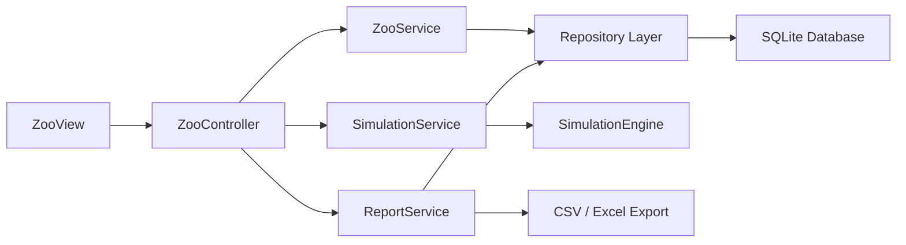
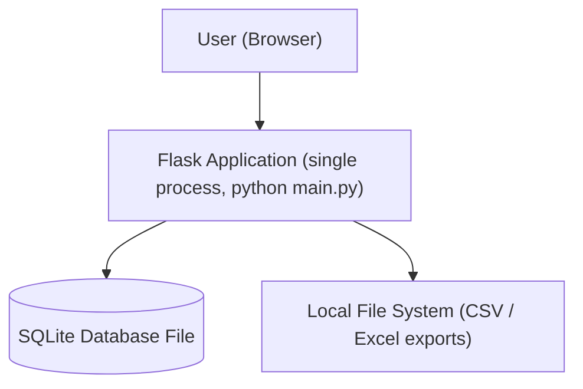

## Architecture & System Diagrams

Short: High‑level component and deployment views for the zoo simulation system.

### Component Diagram (high level)

Responsibilities:
- `ZooView`: Flask routes and templates — user interaction, forms, rendering.
- `ZooController`: request routing and validation between the view and the service layer (no authentication — out of scope, see `planning.md` section 4.2).
- `ZooService` / `SimulationService` / `ReportService`: business logic mapped from the UML classes in `Klassendiagramm_Code.md`.
- `SimulationEngine`: runs time steps, schedules events, updates domain objects.
- `Repository Layer` + `SQLite Database`: persistent storage and queries.
- `CSV / Excel Export`: report generation via `ReportService`.

### Deployment Diagram (simple)

The application is a single local process — no cloud, load balancer or
separate worker services are planned (see `planning.md` section 4.2,
"Out of Scope").

Notes:
- The Flask app, the simulation logic and the SQLite access all run in one
  process on the local machine; the simulation step is triggered by a user
  request (e.g. `POST /simulation/step`), not by a background worker.
- The project uses `SQLite` as its single persistence choice (no MySQL/production alternative planned; see `Funktionale_und_nichtfunktionale_Anforderungen.md` NFR-03).

### Mapping to UML
- Components map to groups of classes in `Klassendiagramm_Code.md` (e.g. `ZooService` → Application Services; `SimulationEngine` → Simulation component).
