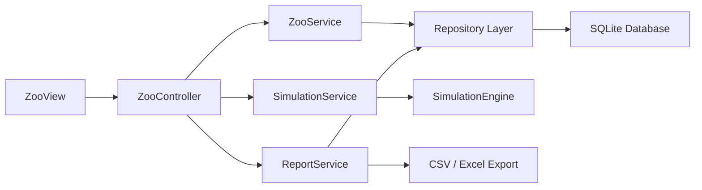
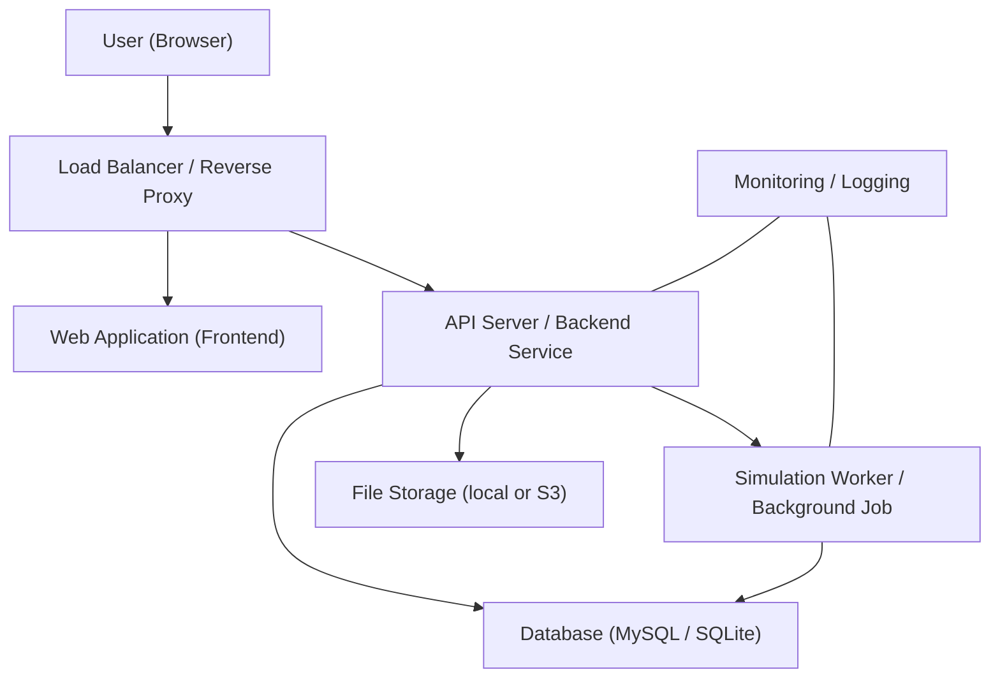

## Architecture & System Diagrams

Short: High‑level component and deployment views for the zoo simulation system.

### Component Diagram (high level)

Responsibilities:
- `Web Client`: UI, user interactions, wireframes.
- `API`: authentication, request routing, validation.
- `Application Services`: business logic mapped from UML classes.
- `Simulation Engine`: runs time steps, schedules events, updates domain objects.
- `Repositories` + `Database`: persistent storage and queries.
- `File Export`: report generation (CSV/Excel).

### Deployment Diagram (simple)

Notes:
- The SimulationWorker can be run as a separate scalable service or as a scheduled job. 
- For local/simple deployments use `SQLite`; for production choose MySQL and proper backups.
- Monitoring/Logging should capture simulation metrics, errors and performance.

### Mapping to UML
- Components map to groups of classes in `Klassendiagramm_Code.md` (e.g. `ZooService` → Application Services; `SimulationEngine` → Simulation component).

Next: review this architecture sketch; say `next` to generate the ER‑diagram / data model.
