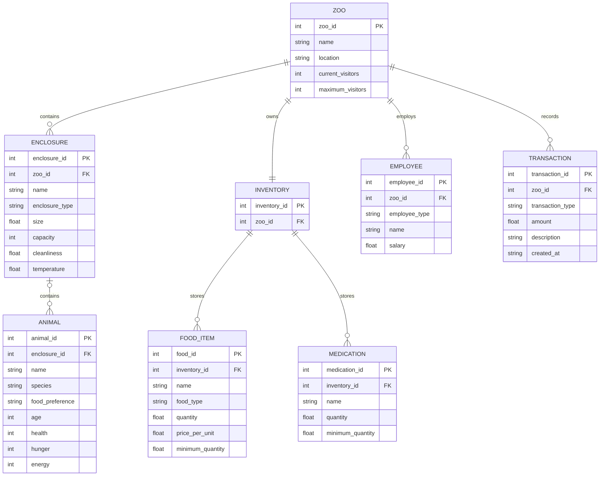

## ER Diagram / Data Model

Short: Entity-Relationship diagram and table definitions for the persistent data model.

Notes:
- `PK` marks the primary key, `FK` marks a foreign key referencing the parent entity from the relationship above (e.g. `ENCLOSURE.zoo_id` references `ZOO.zoo_id`).
- `ENCLOSURE |o--o{ ANIMAL` is intentionally zero-or-one on the `ENCLOSURE` side: `ANIMAL.enclosure_id` is a nullable FK, so an animal can exist without being assigned to an enclosure (e.g. right after creation, or while being moved). This matches the Aggregation semantics in `planning.md` §8.5 ("Animals can be moved between different Enclosures", i.e. `Animal` exists independently of `Enclosure`).
- The persistence layer is SQLite only (see `Funktionale_und_nichtfunktionale_Anforderungen.md` NFR-03); no MySQL variant is planned.
- `SCHEDULED_EVENT` is intentionally **not** modeled as a table: per the class diagram, `EventScheduler` keeps `scheduled_events` purely in memory (no repository reads/writes it), so a persisted table would never be used. It can be added later if the simulation needs to persist events across runs.
- `FEEDING_RECORD` and `TREATMENT_RECORD` (not yet modeled above) could capture historical events for auditing and simulation replay if the team decides to add feeding/treatment history later.
