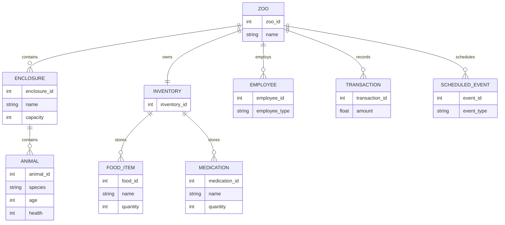

## ER Diagram / Data Model

Short: Entity-Relationship diagram and table definitions for the persistent data model.

Notes:
- Use `FK` to indicate foreign keys; adapt types for chosen DB (SQLite vs MySQL).
- `SPECIES` is separated to allow easy addition of new species without schema changes to `ANIMAL`.
- `FEEDING_RECORD` and `TREATMENT_RECORD` capture historical events for auditing and simulation replay.

Next: review the ER model and tell me `next` to produce SQL table skeletons or move to `Klassendiagramme vervollständigen`.
