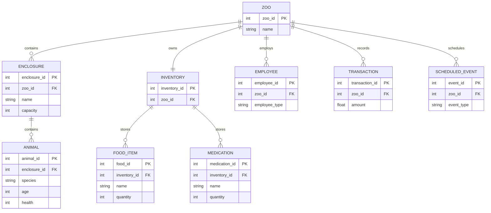

## ER Diagram / Data Model

Short: Entity-Relationship diagram and table definitions for the persistent data model.

Notes:
- `PK` marks the primary key, `FK` marks a foreign key referencing the parent entity from the relationship above (e.g. `ENCLOSURE.zoo_id` references `ZOO.zoo_id`).
- The persistence layer is SQLite only (see `Funktionale_und_nichtfunktionale_Anforderungen.md` NFR-04); no MySQL variant is planned.
- `FEEDING_RECORD` and `TREATMENT_RECORD` (not yet modeled above) could capture historical events for auditing and simulation replay if the team decides to add feeding/treatment history later.
