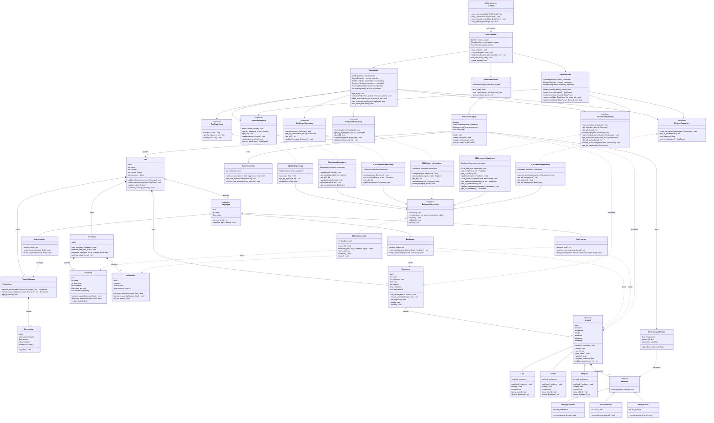

```mermaid
classDiagram
    direction TB
    %% =========================
    %% MVC: VIEW AND CONTROLLER
    %% =========================

    class ZooView {
        <<Flask blueprint>>
        +show_zoo_status(data: DataFrame) void
        +show_animals(data: DataFrame) void
        +show_financial_report(data: DataFrame) void
        +show_message(message: str) void
    }

    class ZooController {
        -ZooService zoo_service
        -SimulationService simulation_service
        -ReportService report_service
        +show_status() void
        +add_animal(data: dict) void
        +feed_animal(animal_id: int, food_id: int) void
        +run_simulation_step() void
        +create_report() void
    }

    %% =========================
    %% SERVICE LAYER
    %% =========================

    class ZooService {
        -ZooRepository zoo_repository
        -AnimalRepository animal_repository
        -EnclosureRepository enclosure_repository
        -EmployeeRepository employee_repository
        -InventoryRepository inventory_repository
        -FinanceRepository finance_repository
        +get_zoo() Zoo
        +add_animal(animal: Animal, enclosure_id: int) void
        +feed_animal(animal_id: int, food_id: int) void
        +hire_employee(employee: Employee) void
        +sell_ticket(price: float) void
    }

    class SimulationService {
        -SimulationEngine simulation_engine
        +run_step() void
        +run_steps(number_of_steps: int) void
        +get_simulation_time() int
    }

    class ReportService {
        -AnimalRepository animal_repository
        -FinanceRepository finance_repository
        -InventoryRepository inventory_repository
        +create_animal_report() DataFrame
        +create_financial_report() DataFrame
        +create_inventory_report() DataFrame
        +export_csv(data: DataFrame, file_path: str) void
        +export_excel(data: DataFrame, file_path: str) void
    }

    %% =========================
    %% DOMAIN MODEL - ZOO VERWALTUNG
    %% =========================

    class Zoo {
        -int id
        -str name
        -str location
        -int current_visitors
        -int maximum_visitors
        +add_enclosure(enclosure: Enclosure) void
        +add_employee(employee: Employee) void
        +register_visitor() bool
        +calculate_average_welfare() float
    }

    class Enclosure {
        -int id
        -str name
        -str enclosure_type
        -float size
        -int capacity
        -float cleanliness
        -float temperature
        +add_animal(animal: Animal) void
        +remove_animal(animal_id: int) void
        +has_capacity() bool
        +clean() void
        +update() void
    }

    class Employee {
        <<abstract>>
        -int id
        -str name
        -float salary
        +perform_task() str*
        +calculate_daily_salary() float
    }

    class Zookeeper {
        +perform_task() str
        +feed_animal(animal: Animal, food: FoodItem) void
        +clean_enclosure(enclosure: Enclosure) void
    }

    class Veterinarian {
        +perform_task() str
        +examine_animal(animal: Animal) str
        +treat_animal(animal: Animal, medication: Medication) void
    }

    class Administrator {
        +perform_task() str
        +record_income(amount: float) void
        +record_expense(amount: float) void
    }

    class Inventory {
        -int id
        +add_item(item: FoodItem) void
        +remove_item(item_id: int) void
        +consume_item(item_id: int, quantity: float) bool
        +get_low_stock_items() list
    }

    class FoodItem {
        -int id
        -str name
        -str food_type
        -float quantity
        -float price_per_unit
        -float minimum_quantity
        +increase_quantity(amount: float) void
        +decrease_quantity(amount: float) bool
        +is_low_stock() bool
    }

    class Medication {
        -int id
        -str name
        -float quantity
        -float minimum_quantity
        +increase_quantity(amount: float) void
        +decrease_quantity(amount: float) bool
        +is_low_stock() bool
    }

    class FinanceManager {
        -float balance
        +record_income(amount: float, description: str) Transaction
        +record_expense(amount: float, description: str) Transaction
        +get_balance() float
    }

    class Transaction {
        -int id
        -str transaction_type
        -float amount
        -str description
        -datetime created_at
        +is_valid() bool
    }

    %% =========================
    %% DOMAIN MODEL - TIERSIMULATION
    %% =========================

    class Animal {
        <<abstract>>
        -int id
        -str name
        -str species
        -int age
        -int health
        -int hunger
        -int energy
        +eat(food: FoodItem) void*
        +sleep() void*
        +move() str*
        +grow_older() void*
        +update() void
        +calculate_welfare() float
        #validate_value(value: int) int
    }

    class Lion {
        -str food_preference
        +eat(food: FoodItem) void
        +sleep() void
        +move() str
        +grow_older() void
        +typical_behavior() str
    }

    class Giraffe {
        -str food_preference
        +eat(food: FoodItem) void
        +sleep() void
        +move() str
        +grow_older() void
        +typical_behavior() str
    }

    class Penguin {
        -str food_preference
        +eat(food: FoodItem) void
        +sleep() void
        +move() str
        +grow_older() void
        +typical_behavior() str
    }

    class Behavior {
        <<abstract>>
        +execute(animal: Animal) void*
    }

    class FeedingBehavior {
        -str food_preference
        +execute(animal: Animal) void
    }

    class SocialBehavior {
        -int social_level
        +execute(animal: Animal) void
    }

    class RestBehavior {
        -int rest_duration
        +execute(animal: Animal) void
    }

    class EnvironmentalFactor {
        -float temperature
        -str time_of_day
        -str weather_condition
        +get_influence_factor() float
    }

    %% =========================
    %% SIMULATIONSKERN
    %% =========================

    class SimulationEngine {
        -Zoo zoo
        -EventScheduler event_scheduler
        -EnvironmentalFactor environment
        -int current_step
        +tick() void
        +update_animals() void
        +update_enclosures() void
        +process_daily_costs() void
    }

    class EventScheduler {
        -list scheduled_events
        +schedule_event(event: dict, trigger_time: int) void
        +get_due_events(current_time: int) list
        +execute_due_events(current_time: int) void
    }

    %% =========================
    %% REPOSITORY INTERFACES
    %% =========================

    class ZooRepository {
        <<interface>>
        +save(zoo: Zoo) void
        +get_by_id(zoo_id: int) Zoo
        +update(zoo: Zoo) void
    }

    class AnimalRepository {
        <<interface>>
        +save(animal: Animal) void
        +get_by_id(animal_id: int) Animal
        +get_all() list
        +update(animal: Animal) void
        +delete(animal_id: int) void
        +get_as_dataframe() DataFrame
    }

    class EnclosureRepository {
        <<interface>>
        +save(enclosure: Enclosure) void
        +get_by_id(enclosure_id: int) Enclosure
        +get_all() list
        +update(enclosure: Enclosure) void
    }

    class EmployeeRepository {
        <<interface>>
        +save(employee: Employee) void
        +get_by_id(employee_id: int) Employee
        +get_all() list
        +update(employee: Employee) void
        +delete(employee_id: int) void
    }

    class InventoryRepository {
        <<interface>>
        +save_item(item: FoodItem) void
        +get_item(item_id: int) FoodItem
        +get_all_items() list
        +update_item(item: FoodItem) void
        +save_medication(medication: Medication) void
        +get_medication(medication_id: int) Medication
        +get_all_medications() list
        +update_medication(medication: Medication) void
        +get_as_dataframe() DataFrame
    }

    class FinanceRepository {
        <<interface>>
        +save_transaction(transaction: Transaction) void
        +get_all_transactions() list
        +get_balance() float
        +get_as_dataframe() DataFrame
    }

    %% =========================
    %% DATABASE LAYER
    %% =========================

    class DatabaseConnection {
        <<interface>>
        +connect() void
        +execute(query: str, parameters: tuple) object
        +commit() void
        +rollback() void
        +close() void
    }

    class SQLiteConnection {
        -str database_path
        +connect() void
        +execute(query: str, parameters: tuple) object
        +commit() void
        +rollback() void
        +close() void
    }

    class SQLZooRepository {
        -DatabaseConnection connection
        +save(zoo: Zoo) void
        +get_by_id(zoo_id: int) Zoo
        +update(zoo: Zoo) void
    }

    class SQLAnimalRepository {
        -DatabaseConnection connection
        +save(animal: Animal) void
        +get_by_id(animal_id: int) Animal
        +get_all() list
        +update(animal: Animal) void
        +delete(animal_id: int) void
        +get_as_dataframe() DataFrame
    }

    class SQLEnclosureRepository {
        -DatabaseConnection connection
        +save(enclosure: Enclosure) void
        +get_by_id(enclosure_id: int) Enclosure
        +get_all() list
        +update(enclosure: Enclosure) void
    }

    class SQLEmployeeRepository {
        -DatabaseConnection connection
        +save(employee: Employee) void
        +get_by_id(employee_id: int) Employee
        +get_all() list
        +update(employee: Employee) void
        +delete(employee_id: int) void
    }

    class SQLInventoryRepository {
        -DatabaseConnection connection
        +save_item(item: FoodItem) void
        +get_item(item_id: int) FoodItem
        +get_all_items() list
        +update_item(item: FoodItem) void
        +save_medication(medication: Medication) void
        +get_medication(medication_id: int) Medication
        +get_all_medications() list
        +update_medication(medication: Medication) void
        +get_as_dataframe() DataFrame
    }

    class SQLFinanceRepository {
        -DatabaseConnection connection
        +save_transaction(transaction: Transaction) void
        +get_all_transactions() list
        +get_balance() float
        +get_as_dataframe() DataFrame
    }

    %% =========================
    %% INHERITANCE
    %% =========================

    Animal <|-- Lion
    Animal <|-- Giraffe
    Animal <|-- Penguin

    Employee <|-- Zookeeper
    Employee <|-- Veterinarian
    Employee <|-- Administrator

    Behavior <|-- FeedingBehavior
    Behavior <|-- SocialBehavior
    Behavior <|-- RestBehavior

    DatabaseConnection <|.. SQLiteConnection

    ZooRepository <|.. SQLZooRepository
    AnimalRepository <|.. SQLAnimalRepository
    EnclosureRepository <|.. SQLEnclosureRepository
    EmployeeRepository <|.. SQLEmployeeRepository
    InventoryRepository <|.. SQLInventoryRepository
    FinanceRepository <|.. SQLFinanceRepository

    %% =========================
    %% DOMAIN RELATIONSHIPS
    %% =========================

    Zoo *-- "1..*" Enclosure : owns
    Zoo o-- "0..*" Employee : employs
    Zoo *-- "1" Inventory : owns
    Zoo *-- "1" FinanceManager : owns

    Enclosure o-- "0..*" Animal : houses
    Inventory *-- "0..*" FoodItem : contains
    Inventory *-- "0..*" Medication : contains
    FinanceManager *-- "0..*" Transaction : creates

    Animal *-- "1..*" Behavior : composed of

    Zookeeper ..> Animal : feeds
    Zookeeper ..> Enclosure : cleans
    Zookeeper ..> FoodItem : uses
    Veterinarian ..> Animal : treats
    Veterinarian ..> Medication : uses
    Administrator ..> FinanceManager : manages

    EnvironmentalFactor ..> Behavior : influences

    SimulationEngine --> Zoo : updates
    SimulationEngine --> EventScheduler : uses
    SimulationEngine --> EnvironmentalFactor : uses
    SimulationEngine ..> Animal : simulates
    SimulationEngine ..> Enclosure : simulates

    %% =========================
    %% MVC AND SERVICE RELATIONSHIPS
    %% =========================

    ZooView --> ZooController : user actions
    ZooController --> ZooService
    ZooController --> SimulationService
    ZooController --> ReportService

    ZooService --> ZooRepository
    ZooService --> AnimalRepository
    ZooService --> EnclosureRepository
    ZooService --> EmployeeRepository
    ZooService --> InventoryRepository
    ZooService --> FinanceRepository

    SimulationService --> SimulationEngine

    ReportService --> AnimalRepository
    ReportService --> InventoryRepository
    ReportService --> FinanceRepository

    %% =========================
    %% DATABASE RELATIONSHIPS
    %% =========================

    SQLZooRepository --> DatabaseConnection
    SQLAnimalRepository --> DatabaseConnection
    SQLEnclosureRepository --> DatabaseConnection
    SQLEmployeeRepository --> DatabaseConnection
    SQLInventoryRepository --> DatabaseConnection
    SQLFinanceRepository --> DatabaseConnection
```