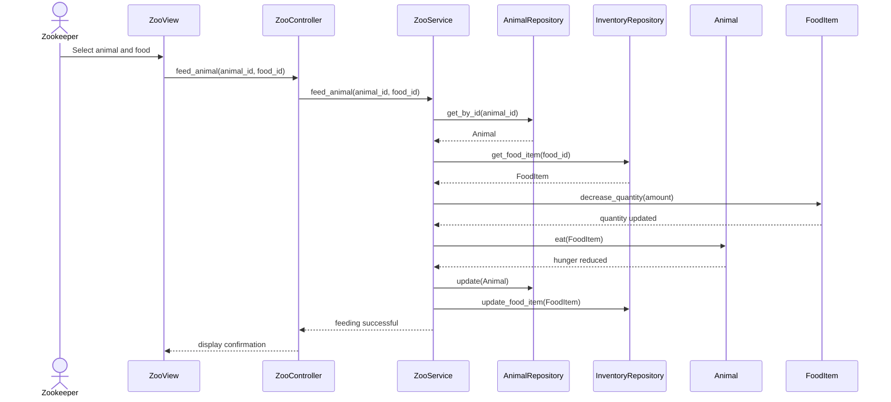

## Sequence Diagram — Animal Feeding

Sequence diagram showing the feeding flow (Zookeeper → ZooView → ZooController → ZooService → Repositories → Animal / FoodItem).

Hinweis: Möchtest du, dass ich diese Datei in `Projektplanung/UserStories_UseCases.md` verlinke oder gleich weitere Sequenzdiagramme erstelle?