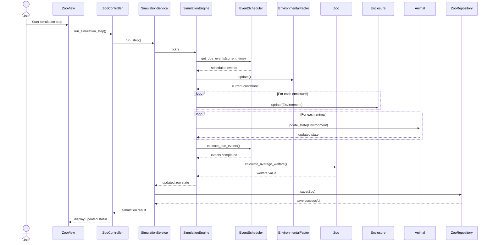

## Sequence Diagram — Simulation Step

Sequence diagram showing a single simulation step flow (User → ZooView → ZooController → SimulationService → SimulationEngine → EventScheduler/Environment → domain objects).

Note: Soll ich diese Datei in `Projektplanung/UserStories_UseCases.md` verlinken oder weitere Sequenzdiagramme erstellen?