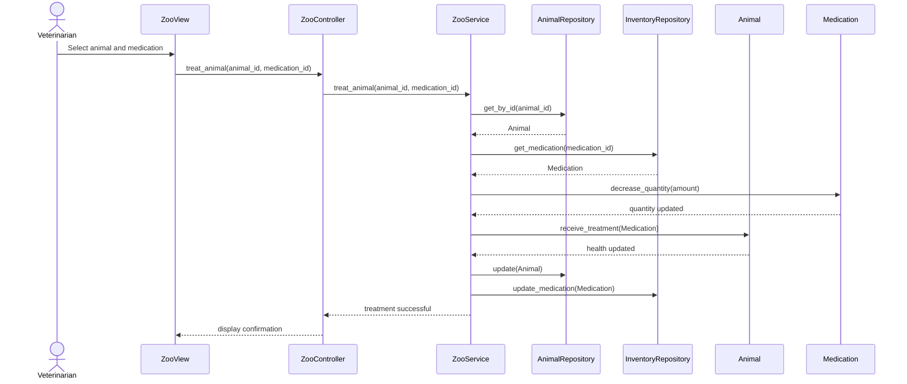

## Sequence Diagram — Veterinary Treatment

Sequence diagram showing the treatment flow (Veterinarian → ZooView → ZooController → ZooService → Repositories → Animal / Medication).

```mermaid
sequenceDiagram
    actor Veterinarian
    participant View as ZooView
    participant Controller as ZooController
    participant Service as ZooService
    participant AnimalRepo as AnimalRepository
    participant InventoryRepo as InventoryRepository
    participant Animal
    participant Medication

    Veterinarian->>View: Select animal and medication
    View->>Controller: treat_animal(animal_id, medication_id)
    Controller->>Service: treat_animal(animal_id, medication_id)

    Service->>AnimalRepo: get_by_id(animal_id)
    AnimalRepo-->>Service: Animal

    Service->>InventoryRepo: get_medication(medication_id)
    InventoryRepo-->>Service: Medication

    Service->>Medication: decrease_quantity(amount)
    Medication-->>Service: quantity updated

    Service->>Animal: receive_treatment(Medication)
    Animal-->>Service: health updated

    Service->>AnimalRepo: update(Animal)
    Service->>InventoryRepo: update_medication(Medication)

    Service-->>Controller: treatment successful
    Controller-->>View: display confirmation
```