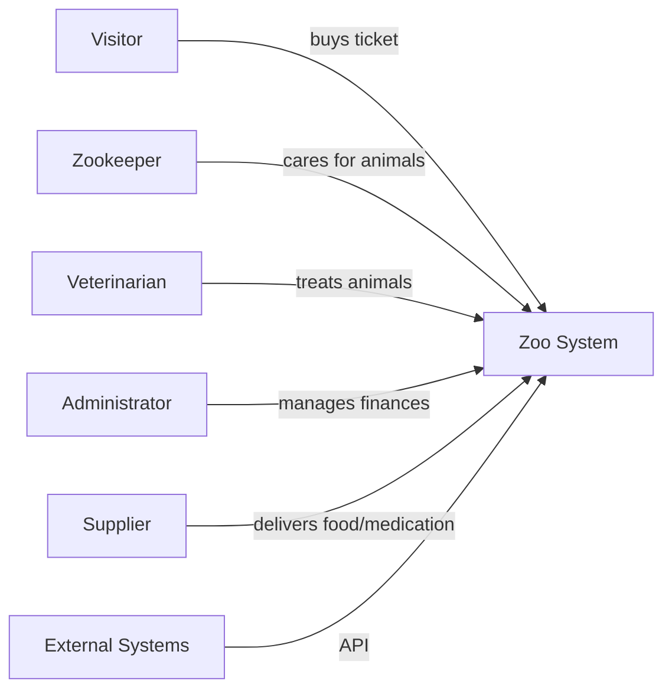

## Stakeholders & Requirements

Short: Identify all stakeholders and their primary requirements.

- Functional examples:
  - Visitors can purchase tickets
  - Zookeepers manage feedings and cleaning
  - Veterinarians document examinations
  - Administrators manage finances and reports
  - System can export reports (CSV/Excel)

- Non-functional examples:
  - Performance: response time < 200 ms for key endpoints
  - Security: authentication for staff functions
  - Scalability: modular services for the simulation

- Acceptance criteria:
  - Stakeholder list is complete
  - Prioritized requirements are documented
  - Open questions and assumptions are recorded
