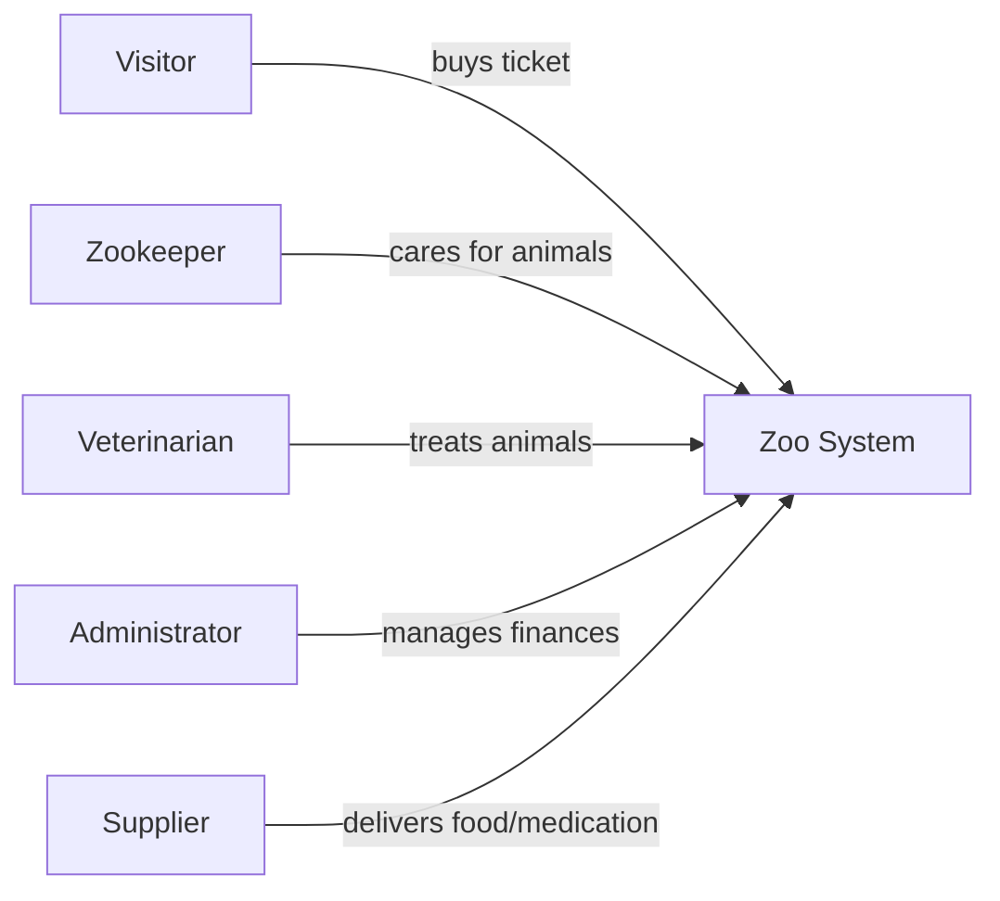

## Stakeholders & Requirements

Short: Identify all stakeholders and their primary requirements.

- Functional examples:
  - Visitors can purchase tickets
  - Zookeepers manage feedings and cleaning
  - Veterinarians document examinations
  - Administrators manage finances and reports
  - System can export reports (CSV/Excel)

- Non-functional examples:
  - Performance: response time < 500 ms for key user interactions (see NFR-01)
  - Reliability: invalid operations must not corrupt persisted data
  - Extensibility: new animal species or employee types can be added without touching existing classes

Note: user authentication is out of scope for this project (see `planning.md`
section 4.2); there is no external system integration (`Supplier` is a
real-world stakeholder, not a software integration).

- Acceptance criteria:
  - Stakeholder list is complete
  - Prioritized requirements are documented
  - Open questions and assumptions are recorded
