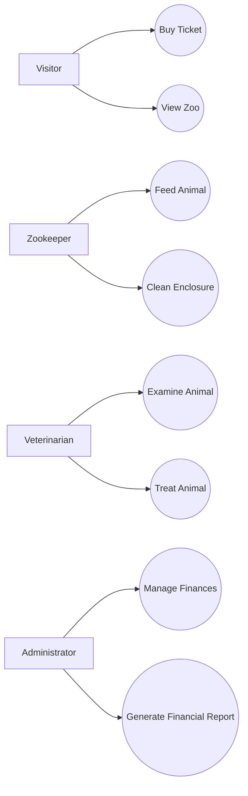

## User Stories / Use Cases

Short: Visualize use cases; user stories serve as the basis for the backlog.

- Example User Story (Template):
  - Title: As a <role>, I want <goal>, so that <benefit>.
  - Acceptance Criteria:
    - Given/When/Then criteria
    - Test specifications / example data
  - Priority: [high/medium/low]
  - Effort estimate: [Story Points]

- Example:
  - Title: As a visitor I want to buy tickets online so that I can enter the zoo.
  - Acceptance Criteria:
    - Given: visitor is on the purchase page
    - When: payment details entered and payment succeeds
    - Then: ticket is sent by email
  - Priority: high
  - Effort: 3 SP

Instructions: Review the use-case diagram; add concrete user stories for your main flows. Say `next` when I should create the `Functional & Non-Functional Requirements` section.
