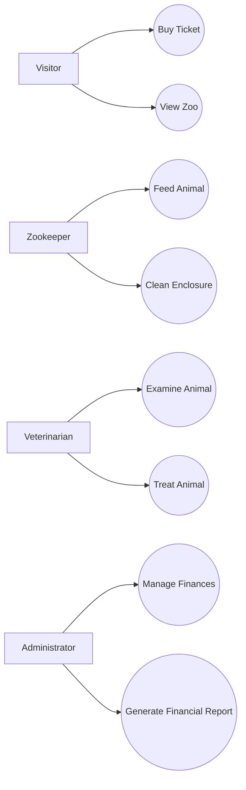

## User Stories / Use Cases

Short: Visualize use cases; user stories serve as the basis for the backlog.

### User Stories

**US-01 — Buy Ticket**
- Title: As a visitor, I want to buy a ticket, so that I can enter the zoo.
- Acceptance Criteria:
  - Given: a visitor requests a ticket
  - When: the purchase is confirmed
  - Then: the visitor count is updated and the transaction is recorded
- Priority: high
- Effort: 3 SP

**US-02 — View Zoo Status**
- Title: As a visitor, I want to view the current state of the zoo, so that I can see which animals and enclosures are available.
- Acceptance Criteria:
  - Given: the zoo application is running
  - When: a visitor requests the zoo status
  - Then: current animals, enclosures and their conditions are displayed
- Priority: medium
- Effort: 2 SP

**US-03 — Feed Animal**
- Title: As a zookeeper, I want to feed an animal, so that its hunger level decreases and its welfare improves.
- Acceptance Criteria:
  - Given: a selected animal and available food in the inventory
  - When: the zookeeper performs the feeding
  - Then: the animal's hunger decreases and the food inventory quantity is reduced
- Priority: high
- Effort: 3 SP

**US-04 — Clean Enclosure**
- Title: As a zookeeper, I want to clean an enclosure, so that its cleanliness improves and animal welfare is not negatively affected.
- Acceptance Criteria:
  - Given: an enclosure with reduced cleanliness
  - When: the zookeeper performs the cleaning
  - Then: the enclosure's cleanliness value is increased and persisted
- Priority: medium
- Effort: 2 SP

**US-05 — Examine Animal**
- Title: As a veterinarian, I want to examine an animal, so that I can assess its health status before deciding on treatment.
- Acceptance Criteria:
  - Given: an animal is selected for examination
  - When: the veterinarian performs the examination
  - Then: the animal's current health status is reported
- Priority: medium
- Effort: 2 SP

**US-06 — Treat Animal**
- Title: As a veterinarian, I want to treat a sick animal with medication, so that its health improves.
- Acceptance Criteria:
  - Given: an animal requiring medical attention and available medication
  - When: the veterinarian performs the treatment
  - Then: the animal's health status improves and the medication stock is reduced
- Priority: high
- Effort: 3 SP

**US-07 — Manage Finances**
- Title: As an administrator, I want to record income and expenses, so that the zoo's financial balance stays accurate.
- Acceptance Criteria:
  - Given: an income or expense event occurs (e.g. ticket sale, salary payment)
  - When: the administrator records the transaction
  - Then: the balance is updated and the transaction is stored
- Priority: high
- Effort: 3 SP

**US-08 — Generate Financial Report**
- Title: As an administrator, I want to generate a financial report, so that I can review the zoo's economic performance.
- Acceptance Criteria:
  - Given: financial transaction data exists
  - When: the administrator generates a report
  - Then: a CSV or Excel report is exported successfully
- Priority: medium
- Effort: 2 SP
