# Individual Planning — Backend (Darnell Beganovic)

This document contains the individual, schwerpunkt-specific planning for the
Backend focus area, as required by the module assignment. Shared decisions
(overall scope, architecture, team structure) are documented in
[`planning.md`](planning.md); this document goes into the detail owned by the
Backend role: the domain model, the service/controller layer and the
simulation core.

## 1. Scope of the Backend Focus

The Backend focus area covers:

- The domain layer: `Zoo`, `Employee` hierarchy, `Animal` hierarchy,
  `Enclosure`, `Inventory`, `FinanceManager`, `Transaction`.
- The service layer: `ZooService`, `SimulationService`. `ReportService`
  is owned by the Database focus (Kaiss), since it builds directly on the
  repositories' `get_as_dataframe()` methods and CSV/Excel export.
- The controller layer: `ZooController`, which mediates between the Flask
  frontend (Alessio) and the service layer.
- The simulation core: `SimulationEngine`, `EventScheduler`,
  `EnvironmentalFactor`.

The Backend layer depends on the Repository interfaces (owned by the
Database focus, Kaiss) but never on a concrete SQLite implementation
directly (Dependency Inversion Principle).

## 2. Class Diagram (Backend Focus)

The diagram below is the Backend-relevant subset of the full class diagram in
[`../../Projektplanung/Klassendiagramm_Code.md`](../../Projektplanung/Klassendiagramm_Code.md).

```mermaid
classDiagram
    direction TB

    %% NOTE (2026-08-06, agreed Frontend/Backend, see
    %% planning_frontend_alessio.md sections 2.1/2.2): ZooController methods
    %% return a uniform result dict {"success": bool, "message": str,
    %% "data": Any} instead of void, so ZooView can render success/error
    %% messages and the returned data without touching the service layer.
    %% sell_ticket() was added to close a gap between the frontend route
    %% table (/tickets/buy) and this diagram, which had no ticket method.
    class ZooController {
        -ZooService zoo_service
        -SimulationService simulation_service
        -ReportService report_service
        +show_status() dict
        +add_animal(data: dict) dict
        +remove_animal(animal_id: int) dict
        +feed_animal(animal_id: int, food_id: int, zookeeper_id: int) dict
        +treat_animal(animal_id: int, medication_id: int, veterinarian_id: int) dict
        +hire_employee(data: dict) dict
        +remove_employee(employee_id: int) dict
        +clean_enclosure(enclosure_id: int, zookeeper_id: int) dict
        +sell_ticket(price: float) dict
        +add_food_item(data: dict) dict
        +add_medication(data: dict) dict
        +restock_inventory_item(item_id: int, is_food: bool, amount: float) dict
        +consume_inventory_item(item_id: int, is_food: bool, amount: float) dict
        +remove_inventory_item(item_id: int, is_food: bool) dict
        +run_simulation_step() dict
        +create_report(format: Optional[str]) dict
    }

    class ZooService {
        -int zoo_id
        -ZooRepository zoo_repository
        -AnimalRepository animal_repository
        -EnclosureRepository enclosure_repository
        -EmployeeRepository employee_repository
        -InventoryRepository inventory_repository
        -FinanceRepository finance_repository
        +get_zoo() Zoo
        +add_animal(animal: Animal, enclosure_id: int) int
        +remove_animal(animal_id: int) void
        +feed_animal(animal_id: int, food_id: int, zookeeper_id: int) void
        +treat_animal(animal_id: int, medication_id: int, veterinarian_id: int) void
        +hire_employee(employee: Employee) void
        +remove_employee(employee_id: int) void
        +clean_enclosure(enclosure_id: int, zookeeper_id: int) void
        +sell_ticket(price: float) void
        +add_food_item(food_item: FoodItem) int
        +add_medication(medication: Medication) int
        +restock_inventory_item(item_id: int, is_food: bool, amount: float) void
        +consume_inventory_item(item_id: int, is_food: bool, amount: float) void
        +remove_inventory_item(item_id: int, is_food: bool) void
    }

    class SimulationService {
        -SimulationEngine simulation_engine
        +run_step() void
        +run_steps(number_of_steps: int) void
        +get_simulation_time() int
    }

    class Zoo {
        -int id
        -str name
        -str location
        -int current_visitors
        -int maximum_visitors
        +add_enclosure(enclosure: Enclosure) void
        +add_employee(employee: Employee) void
        +remove_employee(employee_id: int) void
        +register_visitor() bool
        +calculate_average_welfare() float
    }

    class Enclosure {
        -int id
        -str name
        -str enclosure_type
        -float size
        -int capacity
        -float cleanliness
        -float temperature
        +add_animal(animal: Animal) void
        +remove_animal(animal_id: int) void
        +has_capacity() bool
        +clean() void
        +update(temperature: Optional[float]) void
    }

    class Employee {
        <<abstract>>
        -int id
        -str name
        -float salary
        +perform_task() str*
        +calculate_daily_salary() float
    }

    class Zookeeper {
        +perform_task() str
        +feed_animal(animal: Animal, food: FoodItem) void
        +clean_enclosure(enclosure: Enclosure) void
    }

    class Veterinarian {
        +perform_task() str
        +examine_animal(animal: Animal) str
        +treat_animal(animal: Animal, medication: Medication) void
    }

    class Administrator {
        -FinanceManager finance_manager
        +perform_task() str
        +record_income(amount: float, description: Optional[str]) Transaction
        +record_expense(amount: float, description: Optional[str]) Transaction
    }

    class Inventory {
        -int id
        +add_item(item: FoodItem|Medication) void
        +remove_item(item_id: int) void
        +consume_item(item_id: int, quantity: float) bool
        +get_low_stock_items() list
    }

    class FoodItem {
        -int id
        -str name
        -str food_type
        -float quantity
        -float price_per_unit
        -float minimum_quantity
        +increase_quantity(amount: float) void
        +decrease_quantity(amount: float) bool
        +is_low_stock() bool
    }

    class Medication {
        -int id
        -str name
        -float quantity
        -float minimum_quantity
        +increase_quantity(amount: float) void
        +decrease_quantity(amount: float) bool
        +is_low_stock() bool
    }

    class FinanceManager {
        -float balance
        +record_income(amount: float, description: str) Transaction
        +record_expense(amount: float, description: str) Transaction
        +get_balance() float
    }

    class Transaction {
        -int id
        -str transaction_type
        -float amount
        -str description
        -datetime created_at
        +is_valid() bool
    }

    class Animal {
        <<abstract>>
        -int id
        -str name
        -str species
        -int age
        -int health
        -int hunger
        -int energy
        +eat(food: FoodItem) void*
        +sleep() void*
        +move() str*
        +grow_older() void*
        +update() void
        +calculate_welfare() float
        +adjust_health(delta: int) void
        +adjust_hunger(delta: int) void
        +adjust_energy(delta: int) void
        #validate_value(value: int) int
    }

    class Lion {
        -str food_preference
        +eat(food: FoodItem) void
        +sleep() void
        +move() str
        +grow_older() void
        +typical_behavior() str
    }

    class Giraffe {
        -str food_preference
        +eat(food: FoodItem) void
        +sleep() void
        +move() str
        +grow_older() void
        +typical_behavior() str
    }

    class Penguin {
        -str food_preference
        +eat(food: FoodItem) void
        +sleep() void
        +move() str
        +grow_older() void
        +typical_behavior() str
    }

    class Behavior {
        <<abstract>>
        +execute(animal: Animal) void*
    }

    class FeedingBehavior {
        -str food_preference
        +execute(animal: Animal) void
    }

    class SocialBehavior {
        -int social_level
        +execute(animal: Animal) void
    }

    class RestBehavior {
        -int rest_duration
        +execute(animal: Animal) void
    }

    class SimulationEngine {
        -Zoo zoo
        -EventScheduler event_scheduler
        -EnvironmentalFactor environment
        -int current_step
        +tick() void
        +update_animals() void
        +update_enclosures() void
        +process_daily_costs() void
    }

    class EventScheduler {
        -list scheduled_events
        +schedule_event(event: dict, trigger_time: int) void
        +get_due_events(current_time: int) list
        +execute_due_events(current_time: int) void
    }

    Employee <|-- Zookeeper
    Employee <|-- Veterinarian
    Employee <|-- Administrator

    Animal <|-- Lion
    Animal <|-- Giraffe
    Animal <|-- Penguin

    Behavior <|-- FeedingBehavior
    Behavior <|-- SocialBehavior
    Behavior <|-- RestBehavior

    Animal *-- "1..*" Behavior : composed of

    Zoo *-- "1..*" Enclosure : owns
    Zoo o-- "0..*" Employee : employs
    Zoo *-- "1" Inventory : owns
    Zoo *-- "1" FinanceManager : owns

    Enclosure o-- "0..*" Animal : houses
    Inventory *-- "0..*" FoodItem : contains
    Inventory *-- "0..*" Medication : contains
    FinanceManager *-- "0..*" Transaction : creates

    Zookeeper ..> Animal : feeds
    Zookeeper ..> Enclosure : cleans
    Zookeeper ..> FoodItem : uses
    Veterinarian ..> Animal : treats
    Veterinarian ..> Medication : uses
    Administrator --> FinanceManager : manages

    ZooController --> ZooService
    ZooController --> SimulationService
    SimulationService --> SimulationEngine
    SimulationEngine --> Zoo : updates
    SimulationEngine --> EventScheduler : uses
```



### 2.1 ZooController Result Contract (agreed 2026-08-06)

`ZooController` methods return a uniform result dict instead of `void`:

```python
{"success": bool, "message": str, "data": Any}
```

- `success` tells the frontend whether to render a success or error state.
- `message` is a human-readable string the frontend shows as-is (e.g. via a
  flash message).
- `data` carries whatever payload the caller needs (e.g. a DataFrame/dict
  for `show_status()`, or `{"file_path": str, "mimetype": str}` for
  `create_report()` when exporting to CSV/Excel).

`sell_ticket(price: float)` was added because the frontend's `/tickets/buy`
route needs a `ZooController` entry point (only `ZooService.sell_ticket()`
existed before), and the Frontend focus never calls `ZooService` directly
(see the layering rule in `planning.md` §7.1). `create_report()` takes a
`format: Optional[str]` argument (`"csv"`, `"xlsx"`, or `None`/`"html"` for
a plain in-page report); for `"csv"`/`"xlsx"` its `data` field must contain
`{"file_path": str, "mimetype": str}` so the Flask route can stream the
file back via `send_file()` without building the CSV/Excel content itself
(that part is `ReportService`'s job, Database focus).

See `planning_frontend_alessio.md` sections 2.1/2.2 for the full rationale
agreed with Alessio, including why `ZooView`'s own methods keep the
`Response` return type in the diagram despite Flask view functions
returning plain `str` in the actual code.

### 2.2 Behavior Composition & Animal Encapsulation (agreed 2026-08-06)

`Behavior` (and its subclasses `FeedingBehavior`, `SocialBehavior`,
`RestBehavior`, matching the full diagram in
`../../Projektplanung/Klassendiagramm_Code.md`) was present in this
document's diagram only as an abstract class before this addition - the
concrete subclasses and their composition into `Animal` are functional,
not just structural: `Animal.update()` iterates over its composed
Behaviors and calls `execute(self)` on each once per simulation tick.
Each Behavior affects exactly one stat in isolation (hunger, energy or
health) - there is deliberately no blending or interaction between
multiple Behaviors on the same Animal, to keep this composition simple
per aufgabe.md's "Komposition" requirement in Teilbereich 2, without
over-engineering emergent behavior.

Since `Behavior.execute(animal)` is a separate class, not an `Animal`
subclass, it cannot reach `Animal`'s private `_health`/`_hunger`/
`_energy` attributes directly without breaking Kapselung. `Animal`
therefore exposes three new public mutator methods -
`adjust_health(delta)`, `adjust_hunger(delta)`, `adjust_energy(delta)` -
that route every change through the existing `#validate_value()` clamp,
so external Behavior objects can only ever move a stat within its valid
0-100 range, never set it directly or push it out of range. These three
methods are additions to the class diagram versus the original
"Beispiel (abwandelbar)" sketch in `aufgabe.md`; `Lion`/`Giraffe`/
`Penguin`'s `-food_preference` attribute and `+typical_behavior()`
method were likewise adopted from the full diagram (aufgabe.md
Teilbereich 2 explicitly names "Nahrungspräferenzen" and
"typischesVerhalten()").

### 2.3 Enclosure/Inventory/FinanceManager/Transaction Added to This Diagram, Inventory and Administrator Adjustments (agreed 2026-08-06)

Section 1's scope list already named `Enclosure`, `Inventory`,
`FinanceManager` and `Transaction` as Backend-owned domain classes, but
this document's diagram (section 2) had never actually included them -
only the shared `Klassendiagramm_Code.md` had. Added here (with
`FoodItem`/`Medication`, since `Inventory` composes both) so this
Backend-focus diagram is complete for every class this document claims
to own, per aufgabe.md's "schwerpunktspezifisches umfassendes
Klassendiagramm" requirement.

Two implementation-driven adjustments, made while implementing Sprint 3
(`Inventory`, `FinanceManager`, `Enclosure`) and Sprint 4 (`Zookeeper`,
`Veterinarian`, `Administrator`, `Zoo`):

- `Inventory.add_item()`/`remove_item()`/`consume_item()`/
  `get_low_stock_items()` operate on `FoodItem|Medication`, not just
  `FoodItem`. `FoodItem` and `Medication` both expose the same
  `id`/`increase_quantity()`/`decrease_quantity()`/`is_low_stock()`
  interface, and aufgabe.md's own description of `Inventar` says it
  "verwaltet verfügbare Ressourcen wie Futter... oder Medikamente" -
  i.e. one inventory managing both kinds through one interface, matching
  `Inventory *-- FoodItem` and `Inventory *-- Medication` both being
  satisfied by a single mixed collection. Persistence still splits them
  into `food_item`/`medication` tables via
  `InventoryRepository.save_item()`/`save_medication()` - routing each
  item to the right repository call by type is the persisting caller's
  job (Sprint 6, `ZooService`), not `Inventory`'s.
- `Administrator` gained a private `-FinanceManager finance_manager`
  attribute (constructor-injected). The diagram's
  `Administrator ..> FinanceManager : manages` dependency arrow is
  upgraded to `Administrator --> FinanceManager : manages` (association)
  since it is now a stored reference, not just a method-local usage:
  without it, `record_income(amount)`/`record_expense(amount)` (which
  take no `FinanceManager` parameter) would have no `FinanceManager` to
  delegate to. `Zoo` remains the sole owner of the one `FinanceManager`
  instance (`Zoo *-- "1" FinanceManager`); `Administrator` only holds a
  reference to it, it does not own a second one.

### 2.4 ZooService.zoo_id and EnvironmentalFactor Usage (agreed 2026-08-09)

Two implementation-driven additions from Sprint 6 (`ZooService`,
`SimulationService`, `ZooController`) and Sprint 5 (`SimulationEngine`):

- `ZooService` gained a private `-int zoo_id` attribute, constructor-
  injected. `get_zoo() Zoo` takes no parameters, so `ZooService` must
  already know *which* zoo it manages - this matches the single-zoo
  scoping assumption already documented in `planning_db_kaiss.md`
  (`SQLZooRepository`/`SQLEmployeeRepository` likewise assume exactly
  one zoo row). `zoo_id` is fixed for the service's lifetime, not passed
  per call.
- `SimulationEngine`'s `-EnvironmentalFactor environment` attribute was
  present in the diagram from the start, but no method signature ever
  used it explicitly (`Animal.update()`/`Behavior.execute(animal)` take
  no environment parameter, see section 2.2). `update_animals()` now
  applies `EnvironmentalFactor.get_influence_factor()` as a small extra
  energy penalty on every animal, scaled by how unfavorable current
  conditions are (e.g. a storm at night costs a bit more energy than a
  sunny day) - on top of, not instead of, each animal's own Behaviors.
  This is the one place `environment` is actually used, fulfilling the
  `SimulationEngine --> EnvironmentalFactor : uses` relationship
  functionally rather than leaving `environment` a structurally-present
  but unused attribute. Kept deliberately simple: one scaled penalty, no
  per-species variation, no other interaction with Behavior/Animal
  internals.

### 2.5 ZooService.add_animal() Returns int, InventoryRepository.create_inventory() (agreed 2026-08-09)

Two small additions made while wiring `ZooController` into the Flask
frontend (integration work, see `main.py`):

- `ZooService.add_animal()` changes from `void` to `int`, returning the
  new animal's id (`AnimalRepository.save()`'s own return value, simply
  no longer discarded). The frontend's "adopt animal" flow
  (`zoo_view.py`'s `handle_add_animal_form()`) redirects with
  `?highlight=<new-animal-id>` so the game view can briefly highlight
  the newly added animal - it needs that id back from
  `ZooController.add_animal()`, which in turn needs it from
  `ZooService.add_animal()`. Same pattern as the repository layer's
  `save()` methods returning `int` instead of `void`.
- `InventoryRepository`/`SQLInventoryRepository` gain
  `create_inventory(zoo_id: int) int` (Database focus interface,
  Backend-authored addition - see that module's docstring for the full
  rationale): there was no existing way to create the `inventory`
  table's row itself, since `save_item()`/`save_medication()` both
  require an already-existing `inventory_id`. Without it, a brand-new
  Zoo could never get an Inventory to stock, since nothing could create
  its first `inventory` row.

### 2.6 ZooService Caches the Loaded Zoo (agreed 2026-08-09)

Found while wiring `SimulationEngine`/`ZooService`/`ZooController`
together for the first time: `ZooService.get_zoo()` originally called
`ZooRepository.get_by_id()` fresh on every call, and the composition
root constructs `SimulationEngine` with one `Zoo` instance up front. A
freshly re-fetched `Zoo` is a *different* Python object each time
(a new object graph rebuilt from the database rows), even though it
represents the same conceptual zoo - so an animal added via
`ZooService.add_animal()` would never appear in the `Zoo` object
`SimulationEngine` ticks against, and `SimulationEngine`'s own changes
would never be visible to a later `ZooService.get_zoo()` call either.

Resolved by making `get_zoo()` load the `Zoo` once and cache that exact
instance for the service's lifetime; `add_animal()`/`feed_animal()`/
`hire_employee()` now look up and mutate the cached instance's own
Animal/Enclosure/Inventory objects in place (in addition to persisting
via the repositories, unchanged), rather than operating on separately-
fetched copies. `SimulationEngine` is then constructed with this same
cached `Zoo` object, so both classes always see the same in-memory
state within one running process.

Deliberately not solved further than this: `SimulationEngine.tick()`'s
own effects (animal stat changes, salary transactions) are still never
written back to the database - accepted as a known limitation (see that
class's docstring) rather than giving it repository access, since
aufgabe.md does not require production-grade persistence guarantees and
the added complexity was judged out of proportion for this project's
scope. A restarted process re-derives its `Zoo` from whatever was last
persisted via `ZooService`'s own methods, not from any simulated tick
effects.

### 2.7 ZooController Self-Wiring for Zero-Argument Construction (agreed 2026-08-09)

`zoo_view.py` (Frontend focus) instantiates its controller as
`_controller = ZooController()` at blueprint-import time, with the
explicit, already-documented intent that swapping the
`MockZooController` import for the real class is the *only* change
needed there (see that module's own docstring). Since this
instantiation happens before any dedicated composition-root code could
run, `ZooController.__init__()`'s `zoo_service`/`simulation_service`/
`report_service` parameters became optional: when omitted, a new
`_build_default_dependencies()` (in `zoo_controller.py`) connects to a
real SQLite database (`database/zoo.db` by default), applies
`schema.sql`, builds every `SQL*Repository`, and seeds a first zoo (one
Enclosure per known habitat type - Savanna/Grassland/Polar, matching
`static/js/game.js`'s `SPECIES_HABITATS` exactly so every species is
adoptable out of the box - plus a stocked Inventory) if none exists
yet.

This makes `ZooController` a composition root when used this way, which
is not the cleanest possible separation of concerns in the abstract -
but it is the only way to fulfill the frontend's already-established,
already-merged single-touch-point contract without modifying
`zoo_view.py` beyond that one import line. Explicit constructor
injection (passing all three services directly) remains fully
supported and is what every existing test uses; the zero-argument path
exists specifically for this integration constraint.

### 2.8 Hunger Metabolism and Enclosure Temperature Tracking (agreed 2026-08-09)

Found by actually running the wired-up app (not caught by any prior unit-
level test, since each one only exercised a single method in isolation):

- Nothing in the domain model ever *increased* `Animal.hunger` -
  `FeedingBehavior`/`Animal.eat()` only ever decrease it. Animals
  therefore never actually got hungry, making the entire feeding
  feature (and its food economy) pointless. `SimulationEngine.
  update_animals()` now applies a fixed
  `_METABOLISM_HUNGER_INCREASE_PER_TICK` (12) to every animal each
  tick, deliberately larger than `FeedingBehavior`'s passive relief (5),
  so passive foraging alone is not enough to keep an animal fed - manual
  feeding (`ZooService.feed_animal()`) stays necessary.
- `Enclosure.temperature` had no way to ever change after construction
  - `update()` only touched `cleanliness`. It now takes an optional
  `temperature` parameter; `SimulationEngine.update_enclosures()` passes
  `environment.temperature` each tick, so every enclosure tracks the
  current `EnvironmentalFactor` (deliberately simple: no per-habitat
  climate control, every enclosure shows the same outdoor temperature).

### 2.9 ZooController.hire_employee()/clean_enclosure() (agreed 2026-08-09)

Found by manual testing of the running app: there was no way to
interact with Employees or manually clean an Enclosure at all - not a
bug relative to the original diagram, since it never included such
methods on `ZooController`, but a real capability gap once the app is
actually used (`Enclosure.clean()`/`Zookeeper.clean_enclosure()`
existed in the domain model, and `ZooService.hire_employee()` already
existed too, but nothing above them was ever reachable, and the
bootstrap seed hired no one either).

Added:

- `ZooService.clean_enclosure(enclosure_id: int) void` (new - the
  domain/service layer had no manual-cleaning entry point at all): finds
  the enclosure in the cached `Zoo`, calls `Enclosure.clean()`, persists
  via `EnclosureRepository.update()`.
- `ZooController.hire_employee(data: dict) dict` (new): builds the
  correct concrete `Employee` subclass from `data["role"]`/`data["name"]`/
  `data["salary"]`, delegates to `ZooService.hire_employee()` (already
  existed, was simply never called from above).
- `ZooController.clean_enclosure(enclosure_id: int) dict` (new):
  delegates to the new `ZooService.clean_enclosure()`.
- `ZooController.show_status()`'s `data` gains an `employees` key (list
  of `{"id", "name", "role", "salary"}`) so the frontend can display who
  is employed - not part of `controller_stub.py`'s original contract,
  a pure addition.
- The bootstrap seed (`_seed_initial_zoo()`) now also hires one
  Zookeeper/Veterinarian/Administrator, so there is someone to see/
  interact with from the start.

Kept deliberately minimal: no `fire_employee()`, no assigning a
specific employee to a specific task (e.g. "this Zookeeper cleans this
Enclosure") - `clean_enclosure()` is a generic action not attributed to
an individual employee, matching the scope of what was actually asked
for.

### 2.10 Feeding Cost and ZooController.treat_animal() (agreed 2026-08-09)

Found by using the running app:

- `feed_animal()` never actually cost anything - `Animal.eat()` has no
  `FinanceManager` access (matching its diagram, it is a pure domain
  method), and nothing above it ever booked the cost either.
  `ZooService.feed_animal()` now compares the fed `FoodItem`'s quantity
  before/after `Animal.eat()`, and if any was actually consumed, records
  `amount_consumed * price_per_unit` as an expense via the zoo's
  `FinanceManager`, persisted the same way `sell_ticket()` already
  persists its income Transaction.
- The frontend's "Behandeln" button (game view popup) was a disabled
  placeholder ("Tierarzt-Funktion existiert im Backend noch nicht") -
  `Veterinarian.treat_animal()` existed in the domain model, but no
  `ZooService`/`ZooController` method ever called it. Added
  `ZooService.treat_animal(animal_id, medication_id)` (delegates to the
  zoo's first employed `Veterinarian`, mirroring how `feed_animal()`
  does not require picking a specific `Zookeeper` either) and
  `ZooController.treat_animal(animal_id, medication_id) dict`. Neither
  existed on the original diagram. `ZooController.show_status()`'s
  `data` also gains a `medication_catalog` (list of `{"id", "name"}`,
  parallel to the existing `food_catalog`) so the frontend can offer a
  medication choice; the bootstrap seed now also stocks two starter
  Medications, since there was previously none to treat with at all.
  The frontend half (with Alessio Bellamacina, Frontend-Schwerpunkt):
  `zoo_view.py` gained `POST /animals/<id>/treat`, and
  `animals_game.html`/`game.js` now enable the "Behandeln" button with a
  medication `<select>`, mirroring the existing feeding form.

### 2.11 Inventory Tab, Removal, Explicit Staff Selection, Sleep/Temperature (agreed 2026-08-09)

Found by auditing the codebase for domain methods that existed but were
never called by anything above them - several genuine gaps, not stylistic
deviations:

- **Inventory management tab**: `Inventory.add_item()`/`remove_item()`/
  `consume_item()`/`get_low_stock_items()` existed since the domain
  model's first implementation, but only `add_item()` was ever called
  (once, during bootstrap seeding) - `remove_item()`/`consume_item()`
  had zero callers anywhere. Added `ZooService.add_food_item()`/
  `add_medication()`/`restock_inventory_item()`/
  `consume_inventory_item()`/`remove_inventory_item()` and matching
  `ZooController` methods, plus a new `GET /inventory` page (with
  Alessio Bellamacina, Frontend focus) listing stock with a low-stock
  highlight (`is_low_stock()`) and forms to add/restock/consume/remove.
  `InventoryRepository` gained `delete_item()`/`delete_medication()`
  (Database focus interface, same kind of real gap as
  `create_inventory()` - see that method's own docstring and
  `planning_db_kaiss.md` section 6): there was no way to permanently
  remove a stocked item even though the domain method already existed.
  FoodItem/Medication ids come from two independent auto-increment
  sequences (separate tables), so every new method takes an explicit
  `is_food: bool` to disambiguate - the same ambiguity `feed_animal()`/
  `treat_animal()` already avoid via `isinstance()` filtering.
- **Remove animals/employees**: `AnimalRepository.delete()`/
  `EmployeeRepository.delete()` existed on the Database focus's
  original interfaces but had zero callers - there was no removal
  entry point at all, only `add_animal()`/`hire_employee()`. Added
  `Zoo.remove_employee(employee_id)` (missing counterpart to
  `add_employee()`, unlike `Enclosure` which already had both
  `add_animal()`/`remove_animal()`) and `ZooService`/`ZooController`
  `remove_animal()`/`remove_employee()`. This supersedes section 2.9's
  "no `fire_employee()`" scope note - firing employees is now
  supported, and cleaning/feeding/treating a specific enclosure/animal
  gracefully disables in the UI (with Alessio Bellamacina) if the last
  matching employee was just removed, instead of crashing.
- **Explicit staff selection for feed/clean/treat**: `Zookeeper.
  feed_animal()`/`clean_enclosure()` and `Veterinarian.treat_animal()`
  existed in the domain model, but the service layer bypassed them
  (`ZooService` called `Animal.eat()`/`Enclosure.clean()` directly, and
  `treat_animal()` always picked "the first employed Veterinarian").
  `feed_animal()`/`clean_enclosure()`/`treat_animal()` now all take an
  explicit `zookeeper_id`/`veterinarian_id` and delegate through that
  specific employee, and the frontend (with Alessio Bellamacina) adds a
  matching `<select>` to each form. The "alle hungrigen füttern"
  quick-actions deliberately do NOT prompt per animal - they use
  whichever Zookeeper was last selected in the popup, defaulting to the
  first employed one (client-side only, `game.js`'s `lastZookeeperId`).
- **Income/expense routed through Administrator, no workarounds**:
  `sell_ticket()`/`feed_animal()`'s cost booking previously called
  `zoo.finance_manager.record_income()/record_expense()` directly,
  bypassing `Administrator` entirely despite `Administrator -->
  FinanceManager : manages` in the class diagram - `Administrator.
  record_income()`/`record_expense()` existed but had zero callers.
  Both methods now accept an optional `description` and return the
  created `Transaction` (previously void with a hardcoded description),
  matching `FinanceManager`'s own signature, and `ZooService` routes
  through the zoo's employed `Administrator` via two new private
  helpers (`_record_income()`/`_record_expense()`). Explicit product
  decision: if no Administrator is employed, `sell_ticket()`/
  `feed_animal()` (when the food has a positive price) raise
  `ValueError` rather than silently falling back to `FinanceManager`
  directly - "keine Workarounds". This check runs before any mutation,
  so a rejected action leaves state completely unchanged.
  `SimulationEngine.process_daily_costs()` is the one deliberate
  exception: it also now prefers routing through an employed
  Administrator, but falls back to `FinanceManager` directly if none is
  employed instead of raising, because it runs unconditionally inside
  `tick()`, which `ZooController.run_simulation_step()` calls with no
  try/except - firing the last Administrator must never turn every
  subsequent "Simulationsschritt ausführen" click into a server error.
- **Animals actually sleep sometimes**: `Animal.sleep()`/`move()`
  existed on every concrete species since the domain model's first
  implementation but were never called automatically - only
  `RestBehavior`/`SocialBehavior` (part of the composed Behavior set,
  applied every tick via `Animal.update()`) affected energy, and their
  defaults (`rest_duration=20`, `social_level=50`, i.e. +20/+5 =
  +25 energy/tick combined) always outpaced any possible energy loss
  from movement (3-5/tick depending on species), so energy converged
  toward 100 and never dropped low enough for the frontend's
  already-existing "sleeping" mood indicator (`static/js/game.js`'s
  `computeMood()`, energy < 20, 💤 icon, `animation.js`'s
  `moveSprite()` already skips movement for it) to ever actually
  appear. `SimulationEngine.update_animals()` now calls `sleep()` when
  energy drops below `_SLEEP_ENERGY_THRESHOLD = 20` (matching that same
  frontend constant) and `move()` otherwise, and the defaults were
  lowered to `rest_duration=1`/`social_level=10` (combined +2/tick, less
  than every species' move cost - verified with an actual 40-tick
  simulation run, not just arithmetic) in both `zoo_controller.py`'s
  and `sqlite_animal_repository.py`'s (Database focus, Kaiss - see
  `planning_db_kaiss.md` section 6) default-Behavior builders, so
  energy now genuinely drifts down under normal ticks until `sleep()`
  pushes it back up - a real wake/sleep cycle instead of a one-way climb
  to 100. Additionally, since simulation ticks only advance on a manual
  "Simulationsschritt ausführen" click, a purely presentational,
  client-only "nap" timer was added to `animation.js`
  (`triggerRandomNap()`, with Alessio Bellamacina) that periodically
  puts a random sprite into the same "sleeping" state for a few
  seconds, independent of real energy - guarantees the sleeping
  animation is visibly demonstrable within a short real-time window
  without depending on how many simulation steps the user has run.
- **Per-enclosure temperature ranges**: `SimulationEngine.
  update_enclosures()` previously set every enclosure's temperature to
  the exact same `EnvironmentalFactor.temperature`, making a Polar
  enclosure report the same reading as a Savanna one. Replaced with a
  `_ENCLOSURE_TEMPERATURE_RANGES` map keyed by `enclosure_type`
  (mirroring `_SEED_ENCLOSURES`/`static/js/game.js`'s
  `SPECIES_HABITATS` as the same kind of frontend/backend "single
  source of truth" already used elsewhere in this file) - each
  enclosure's temperature now takes a small bounded random step within
  its own type's range every tick, rounded to 1 decimal place since
  both `index.html` and `animals_game.html` print it directly.
- **Administrator's FinanceManager identity bug (found while verifying
  the above via a real SQLite database)**: `planning_db_kaiss.md`
  section 6 already documented that a reconstructed Administrator gets
  its own fresh `FinanceManager` (equal starting balance, not the same
  object as `Zoo.finance_manager`) as an accepted limitation - accepted
  specifically because nothing routed real transactions through
  `Administrator` yet. Once `sell_ticket()`/`feed_animal()` started
  doing exactly that, this became a real bug: income/expenses were
  recorded on a throwaway object nobody ever read balance from again,
  so the zoo's displayed balance silently never changed. Fixed by
  adding `Administrator.set_finance_manager()` and calling it from
  `ZooService.get_zoo()` (once per cache-fill, for every employed
  Administrator) and `hire_employee()` (for a newly hired
  Administrator, which loads after the cache-fill already ran) -
  every Administrator in the cached Zoo's employee list now shares the
  exact same `FinanceManager` instance the Zoo itself reports balance
  from.

## 3. OOP Principles Applied in the Backend

- **Abstraction**: `Employee` and `Animal` are abstract base classes; concrete
  subclasses implement `perform_task()` / `eat()`, `sleep()`, `move()`.
- **Inheritance & Polymorphism**: `Zookeeper`, `Veterinarian`, `Administrator`
  all implement `perform_task()` differently; `Lion`, `Giraffe`, `Penguin`
  implement `eat()`/`move()` differently while being usable through the
  common `Animal` interface in `SimulationEngine.update_animals()`.
- **Encapsulation**: `Animal` attributes such as `health`, `hunger`, `energy`
  are private and only change through validated methods
  (`#validate_value`), preventing invalid states (e.g. negative hunger).
- **Composition**: `Animal` is composed of `Behavior` objects; `Zoo` is
  composed of `Enclosure` and aggregates `Employee`.
- **Single Responsibility**: `ZooService` handles business rules,
  `SimulationEngine` only advances simulation time, `ZooController` only
  coordinates requests from the frontend.
- **Dependency Inversion**: `ZooService` depends on repository *interfaces*
  (`AnimalRepository`, `FinanceRepository`, …), never on the SQLite
  implementation directly — this keeps the Database focus (Kaiss)
  swappable without touching backend code.

## 4. Test Descriptions (described, not implemented)

Per the assignment, at least two test cases are described for each function
below; they are **not** implemented as automated pytest code.

### `ZooService.feed_animal(animal_id, food_id)`

- TC-B01: Given an animal with hunger=80 and available food, when
  `feed_animal` is called, then hunger decreases and inventory quantity
  decreases by the expected amount.
- TC-B02: Given an animal id that does not exist, when `feed_animal` is
  called, then a `ValueError`/domain exception is raised and no inventory
  change occurs.

### `Animal.eat(food)` (polymorphic, e.g. `Lion`)

- TC-B03: Given a `Lion` with hunger=50 and a food item matching its
  preference, when `eat(food)` is called, then hunger decreases and health
  does not decrease.
- TC-B04: Given a `Lion` and a food item quantity of 0, when `eat(food)` is
  called, then hunger stays unchanged and a "food unavailable" result is
  returned.

### `Employee.perform_task()` (polymorphic, e.g. `Veterinarian.treat_animal`)

- TC-B05: Given a sick animal (health=30) and available medication, when
  `treat_animal` is called, then health increases and medication quantity
  decreases.
- TC-B06: Given a healthy animal (health=100), when `treat_animal` is
  called, then health is capped at the maximum value (no overflow).

### `SimulationEngine.tick()`

- TC-B07: Given a zoo with 2 enclosures and 3 animals, when `tick()` is
  called once, then every animal's `hunger`/`energy`/`age` is updated exactly
  once and `current_step` increases by 1.
- TC-B08: Given a scheduled event due at the current simulation time, when
  `tick()` is called, then `EventScheduler.execute_due_events()` is invoked
  and the event is removed from the pending queue.

### `Zoo.register_visitor()`

- TC-B09: Given `current_visitors < maximum_visitors`, when
  `register_visitor()` is called, then it returns `True` and
  `current_visitors` increases by 1.
- TC-B10: Given `current_visitors == maximum_visitors`, when
  `register_visitor()` is called, then it returns `False` and
  `current_visitors` stays unchanged.

## 5. Open Questions / Assumptions

- The exact division of validation between the Flask layer (Alessio) and the
  service layer (Darnell) is: Flask validates input *shape* (e.g. required
  fields present, correct type), the service layer validates *domain rules*
  (e.g. hunger cannot go below 0).
- As of 2026-08-06, the Frontend (Alessio) has already implemented
  `zoo_view.py` against the result-dict `ZooController` contract in
  section 2.1, using `zoo_simulation/frontend/controller_stub.py`
  (`MockZooController`) as a stand-in. When implementing the real
  `ZooController`, match that contract exactly (return dict, not void;
  include `sell_ticket()`; `create_report(format)`), otherwise the
  frontend's routes will break on integration.
