# Individual Planning — Backend (Darnell Beganovic)

This document contains the individual, schwerpunkt-specific planning for the
Backend focus area, as required by the module assignment. Shared decisions
(overall scope, architecture, team structure) are documented in
[`planning.md`](planning.md); this document goes into the detail owned by the
Backend role: the domain model, the service/controller layer and the
simulation core.

## 1. Scope of the Backend Focus

The Backend focus area covers:

- The domain layer: `Zoo`, `Employee` hierarchy, `Animal` hierarchy,
  `Enclosure`, `Inventory`, `FinanceManager`, `Transaction`.
- The service layer: `ZooService`, `SimulationService`. `ReportService`
  is owned by the Database focus (Kaiss), since it builds directly on the
  repositories' `get_as_dataframe()` methods and CSV/Excel export.
- The controller layer: `ZooController`, which mediates between the Flask
  frontend (Alessio) and the service layer.
- The simulation core: `SimulationEngine`, `EventScheduler`,
  `EnvironmentalFactor`.

The Backend layer depends on the Repository interfaces (owned by the
Database focus, Kaiss) but never on a concrete SQLite implementation
directly (Dependency Inversion Principle).

## 2. Class Diagram (Backend Focus)

The diagram below is the Backend-relevant subset of the full class diagram in
[`../../Projektplanung/Klassendiagramm_Code.md`](../../Projektplanung/Klassendiagramm_Code.md).

```mermaid
classDiagram
    direction TB

    %% NOTE (2026-08-06, agreed Frontend/Backend, see
    %% planning_frontend_alessio.md sections 2.1/2.2): ZooController methods
    %% return a uniform result dict {"success": bool, "message": str,
    %% "data": Any} instead of void, so ZooView can render success/error
    %% messages and the returned data without touching the service layer.
    %% sell_ticket() was added to close a gap between the frontend route
    %% table (/tickets/buy) and this diagram, which had no ticket method.
    class ZooController {
        -ZooService zoo_service
        -SimulationService simulation_service
        -ReportService report_service
        +show_status() dict
        +add_animal(data: dict) dict
        +feed_animal(animal_id: int, food_id: int) dict
        +sell_ticket(price: float) dict
        +run_simulation_step() dict
        +create_report(format: Optional[str]) dict
    }

    class ZooService {
        -int zoo_id
        -ZooRepository zoo_repository
        -AnimalRepository animal_repository
        -EnclosureRepository enclosure_repository
        -EmployeeRepository employee_repository
        -InventoryRepository inventory_repository
        -FinanceRepository finance_repository
        +get_zoo() Zoo
        +add_animal(animal: Animal, enclosure_id: int) int
        +feed_animal(animal_id: int, food_id: int) void
        +hire_employee(employee: Employee) void
        +sell_ticket(price: float) void
    }

    class SimulationService {
        -SimulationEngine simulation_engine
        +run_step() void
        +run_steps(number_of_steps: int) void
        +get_simulation_time() int
    }

    class Zoo {
        -int id
        -str name
        -str location
        -int current_visitors
        -int maximum_visitors
        +add_enclosure(enclosure: Enclosure) void
        +add_employee(employee: Employee) void
        +register_visitor() bool
        +calculate_average_welfare() float
    }

    class Enclosure {
        -int id
        -str name
        -str enclosure_type
        -float size
        -int capacity
        -float cleanliness
        -float temperature
        +add_animal(animal: Animal) void
        +remove_animal(animal_id: int) void
        +has_capacity() bool
        +clean() void
        +update() void
    }

    class Employee {
        <<abstract>>
        -int id
        -str name
        -float salary
        +perform_task() str*
        +calculate_daily_salary() float
    }

    class Zookeeper {
        +perform_task() str
        +feed_animal(animal: Animal, food: FoodItem) void
        +clean_enclosure(enclosure: Enclosure) void
    }

    class Veterinarian {
        +perform_task() str
        +examine_animal(animal: Animal) str
        +treat_animal(animal: Animal, medication: Medication) void
    }

    class Administrator {
        -FinanceManager finance_manager
        +perform_task() str
        +record_income(amount: float) void
        +record_expense(amount: float) void
    }

    class Inventory {
        -int id
        +add_item(item: FoodItem|Medication) void
        +remove_item(item_id: int) void
        +consume_item(item_id: int, quantity: float) bool
        +get_low_stock_items() list
    }

    class FoodItem {
        -int id
        -str name
        -str food_type
        -float quantity
        -float price_per_unit
        -float minimum_quantity
        +increase_quantity(amount: float) void
        +decrease_quantity(amount: float) bool
        +is_low_stock() bool
    }

    class Medication {
        -int id
        -str name
        -float quantity
        -float minimum_quantity
        +increase_quantity(amount: float) void
        +decrease_quantity(amount: float) bool
        +is_low_stock() bool
    }

    class FinanceManager {
        -float balance
        +record_income(amount: float, description: str) Transaction
        +record_expense(amount: float, description: str) Transaction
        +get_balance() float
    }

    class Transaction {
        -int id
        -str transaction_type
        -float amount
        -str description
        -datetime created_at
        +is_valid() bool
    }

    class Animal {
        <<abstract>>
        -int id
        -str name
        -str species
        -int age
        -int health
        -int hunger
        -int energy
        +eat(food: FoodItem) void*
        +sleep() void*
        +move() str*
        +grow_older() void*
        +update() void
        +calculate_welfare() float
        +adjust_health(delta: int) void
        +adjust_hunger(delta: int) void
        +adjust_energy(delta: int) void
        #validate_value(value: int) int
    }

    class Lion {
        -str food_preference
        +eat(food: FoodItem) void
        +sleep() void
        +move() str
        +grow_older() void
        +typical_behavior() str
    }

    class Giraffe {
        -str food_preference
        +eat(food: FoodItem) void
        +sleep() void
        +move() str
        +grow_older() void
        +typical_behavior() str
    }

    class Penguin {
        -str food_preference
        +eat(food: FoodItem) void
        +sleep() void
        +move() str
        +grow_older() void
        +typical_behavior() str
    }

    class Behavior {
        <<abstract>>
        +execute(animal: Animal) void*
    }

    class FeedingBehavior {
        -str food_preference
        +execute(animal: Animal) void
    }

    class SocialBehavior {
        -int social_level
        +execute(animal: Animal) void
    }

    class RestBehavior {
        -int rest_duration
        +execute(animal: Animal) void
    }

    class SimulationEngine {
        -Zoo zoo
        -EventScheduler event_scheduler
        -EnvironmentalFactor environment
        -int current_step
        +tick() void
        +update_animals() void
        +update_enclosures() void
        +process_daily_costs() void
    }

    class EventScheduler {
        -list scheduled_events
        +schedule_event(event: dict, trigger_time: int) void
        +get_due_events(current_time: int) list
        +execute_due_events(current_time: int) void
    }

    Employee <|-- Zookeeper
    Employee <|-- Veterinarian
    Employee <|-- Administrator

    Animal <|-- Lion
    Animal <|-- Giraffe
    Animal <|-- Penguin

    Behavior <|-- FeedingBehavior
    Behavior <|-- SocialBehavior
    Behavior <|-- RestBehavior

    Animal *-- "1..*" Behavior : composed of

    Zoo *-- "1..*" Enclosure : owns
    Zoo o-- "0..*" Employee : employs
    Zoo *-- "1" Inventory : owns
    Zoo *-- "1" FinanceManager : owns

    Enclosure o-- "0..*" Animal : houses
    Inventory *-- "0..*" FoodItem : contains
    Inventory *-- "0..*" Medication : contains
    FinanceManager *-- "0..*" Transaction : creates

    Zookeeper ..> Animal : feeds
    Zookeeper ..> Enclosure : cleans
    Zookeeper ..> FoodItem : uses
    Veterinarian ..> Animal : treats
    Veterinarian ..> Medication : uses
    Administrator --> FinanceManager : manages

    ZooController --> ZooService
    ZooController --> SimulationService
    SimulationService --> SimulationEngine
    SimulationEngine --> Zoo : updates
    SimulationEngine --> EventScheduler : uses
```



### 2.1 ZooController Result Contract (agreed 2026-08-06)

`ZooController` methods return a uniform result dict instead of `void`:

```python
{"success": bool, "message": str, "data": Any}
```

- `success` tells the frontend whether to render a success or error state.
- `message` is a human-readable string the frontend shows as-is (e.g. via a
  flash message).
- `data` carries whatever payload the caller needs (e.g. a DataFrame/dict
  for `show_status()`, or `{"file_path": str, "mimetype": str}` for
  `create_report()` when exporting to CSV/Excel).

`sell_ticket(price: float)` was added because the frontend's `/tickets/buy`
route needs a `ZooController` entry point (only `ZooService.sell_ticket()`
existed before), and the Frontend focus never calls `ZooService` directly
(see the layering rule in `planning.md` §7.1). `create_report()` takes a
`format: Optional[str]` argument (`"csv"`, `"xlsx"`, or `None`/`"html"` for
a plain in-page report); for `"csv"`/`"xlsx"` its `data` field must contain
`{"file_path": str, "mimetype": str}` so the Flask route can stream the
file back via `send_file()` without building the CSV/Excel content itself
(that part is `ReportService`'s job, Database focus).

See `planning_frontend_alessio.md` sections 2.1/2.2 for the full rationale
agreed with Alessio, including why `ZooView`'s own methods keep the
`Response` return type in the diagram despite Flask view functions
returning plain `str` in the actual code.

### 2.2 Behavior Composition & Animal Encapsulation (agreed 2026-08-06)

`Behavior` (and its subclasses `FeedingBehavior`, `SocialBehavior`,
`RestBehavior`, matching the full diagram in
`../../Projektplanung/Klassendiagramm_Code.md`) was present in this
document's diagram only as an abstract class before this addition - the
concrete subclasses and their composition into `Animal` are functional,
not just structural: `Animal.update()` iterates over its composed
Behaviors and calls `execute(self)` on each once per simulation tick.
Each Behavior affects exactly one stat in isolation (hunger, energy or
health) - there is deliberately no blending or interaction between
multiple Behaviors on the same Animal, to keep this composition simple
per aufgabe.md's "Komposition" requirement in Teilbereich 2, without
over-engineering emergent behavior.

Since `Behavior.execute(animal)` is a separate class, not an `Animal`
subclass, it cannot reach `Animal`'s private `_health`/`_hunger`/
`_energy` attributes directly without breaking Kapselung. `Animal`
therefore exposes three new public mutator methods -
`adjust_health(delta)`, `adjust_hunger(delta)`, `adjust_energy(delta)` -
that route every change through the existing `#validate_value()` clamp,
so external Behavior objects can only ever move a stat within its valid
0-100 range, never set it directly or push it out of range. These three
methods are additions to the class diagram versus the original
"Beispiel (abwandelbar)" sketch in `aufgabe.md`; `Lion`/`Giraffe`/
`Penguin`'s `-food_preference` attribute and `+typical_behavior()`
method were likewise adopted from the full diagram (aufgabe.md
Teilbereich 2 explicitly names "Nahrungspräferenzen" and
"typischesVerhalten()").

### 2.3 Enclosure/Inventory/FinanceManager/Transaction Added to This Diagram, Inventory and Administrator Adjustments (agreed 2026-08-06)

Section 1's scope list already named `Enclosure`, `Inventory`,
`FinanceManager` and `Transaction` as Backend-owned domain classes, but
this document's diagram (section 2) had never actually included them -
only the shared `Klassendiagramm_Code.md` had. Added here (with
`FoodItem`/`Medication`, since `Inventory` composes both) so this
Backend-focus diagram is complete for every class this document claims
to own, per aufgabe.md's "schwerpunktspezifisches umfassendes
Klassendiagramm" requirement.

Two implementation-driven adjustments, made while implementing Sprint 3
(`Inventory`, `FinanceManager`, `Enclosure`) and Sprint 4 (`Zookeeper`,
`Veterinarian`, `Administrator`, `Zoo`):

- `Inventory.add_item()`/`remove_item()`/`consume_item()`/
  `get_low_stock_items()` operate on `FoodItem|Medication`, not just
  `FoodItem`. `FoodItem` and `Medication` both expose the same
  `id`/`increase_quantity()`/`decrease_quantity()`/`is_low_stock()`
  interface, and aufgabe.md's own description of `Inventar` says it
  "verwaltet verfügbare Ressourcen wie Futter... oder Medikamente" -
  i.e. one inventory managing both kinds through one interface, matching
  `Inventory *-- FoodItem` and `Inventory *-- Medication` both being
  satisfied by a single mixed collection. Persistence still splits them
  into `food_item`/`medication` tables via
  `InventoryRepository.save_item()`/`save_medication()` - routing each
  item to the right repository call by type is the persisting caller's
  job (Sprint 6, `ZooService`), not `Inventory`'s.
- `Administrator` gained a private `-FinanceManager finance_manager`
  attribute (constructor-injected). The diagram's
  `Administrator ..> FinanceManager : manages` dependency arrow is
  upgraded to `Administrator --> FinanceManager : manages` (association)
  since it is now a stored reference, not just a method-local usage:
  without it, `record_income(amount)`/`record_expense(amount)` (which
  take no `FinanceManager` parameter) would have no `FinanceManager` to
  delegate to. `Zoo` remains the sole owner of the one `FinanceManager`
  instance (`Zoo *-- "1" FinanceManager`); `Administrator` only holds a
  reference to it, it does not own a second one.

### 2.4 ZooService.zoo_id and EnvironmentalFactor Usage (agreed 2026-08-09)

Two implementation-driven additions from Sprint 6 (`ZooService`,
`SimulationService`, `ZooController`) and Sprint 5 (`SimulationEngine`):

- `ZooService` gained a private `-int zoo_id` attribute, constructor-
  injected. `get_zoo() Zoo` takes no parameters, so `ZooService` must
  already know *which* zoo it manages - this matches the single-zoo
  scoping assumption already documented in `planning_db_kaiss.md`
  (`SQLZooRepository`/`SQLEmployeeRepository` likewise assume exactly
  one zoo row). `zoo_id` is fixed for the service's lifetime, not passed
  per call.
- `SimulationEngine`'s `-EnvironmentalFactor environment` attribute was
  present in the diagram from the start, but no method signature ever
  used it explicitly (`Animal.update()`/`Behavior.execute(animal)` take
  no environment parameter, see section 2.2). `update_animals()` now
  applies `EnvironmentalFactor.get_influence_factor()` as a small extra
  energy penalty on every animal, scaled by how unfavorable current
  conditions are (e.g. a storm at night costs a bit more energy than a
  sunny day) - on top of, not instead of, each animal's own Behaviors.
  This is the one place `environment` is actually used, fulfilling the
  `SimulationEngine --> EnvironmentalFactor : uses` relationship
  functionally rather than leaving `environment` a structurally-present
  but unused attribute. Kept deliberately simple: one scaled penalty, no
  per-species variation, no other interaction with Behavior/Animal
  internals.

### 2.5 ZooService.add_animal() Returns int, InventoryRepository.create_inventory() (agreed 2026-08-09)

Two small additions made while wiring `ZooController` into the Flask
frontend (integration work, see `main.py`):

- `ZooService.add_animal()` changes from `void` to `int`, returning the
  new animal's id (`AnimalRepository.save()`'s own return value, simply
  no longer discarded). The frontend's "adopt animal" flow
  (`zoo_view.py`'s `handle_add_animal_form()`) redirects with
  `?highlight=<new-animal-id>` so the game view can briefly highlight
  the newly added animal - it needs that id back from
  `ZooController.add_animal()`, which in turn needs it from
  `ZooService.add_animal()`. Same pattern as the repository layer's
  `save()` methods returning `int` instead of `void`.
- `InventoryRepository`/`SQLInventoryRepository` gain
  `create_inventory(zoo_id: int) int` (Database focus interface,
  Backend-authored addition - see that module's docstring for the full
  rationale): there was no existing way to create the `inventory`
  table's row itself, since `save_item()`/`save_medication()` both
  require an already-existing `inventory_id`. Without it, a brand-new
  Zoo could never get an Inventory to stock, since nothing could create
  its first `inventory` row.

### 2.6 ZooService Caches the Loaded Zoo (agreed 2026-08-09)

Found while wiring `SimulationEngine`/`ZooService`/`ZooController`
together for the first time: `ZooService.get_zoo()` originally called
`ZooRepository.get_by_id()` fresh on every call, and the composition
root constructs `SimulationEngine` with one `Zoo` instance up front. A
freshly re-fetched `Zoo` is a *different* Python object each time
(a new object graph rebuilt from the database rows), even though it
represents the same conceptual zoo - so an animal added via
`ZooService.add_animal()` would never appear in the `Zoo` object
`SimulationEngine` ticks against, and `SimulationEngine`'s own changes
would never be visible to a later `ZooService.get_zoo()` call either.

Resolved by making `get_zoo()` load the `Zoo` once and cache that exact
instance for the service's lifetime; `add_animal()`/`feed_animal()`/
`hire_employee()` now look up and mutate the cached instance's own
Animal/Enclosure/Inventory objects in place (in addition to persisting
via the repositories, unchanged), rather than operating on separately-
fetched copies. `SimulationEngine` is then constructed with this same
cached `Zoo` object, so both classes always see the same in-memory
state within one running process.

Deliberately not solved further than this: `SimulationEngine.tick()`'s
own effects (animal stat changes, salary transactions) are still never
written back to the database - accepted as a known limitation (see that
class's docstring) rather than giving it repository access, since
aufgabe.md does not require production-grade persistence guarantees and
the added complexity was judged out of proportion for this project's
scope. A restarted process re-derives its `Zoo` from whatever was last
persisted via `ZooService`'s own methods, not from any simulated tick
effects.

## 3. OOP Principles Applied in the Backend

- **Abstraction**: `Employee` and `Animal` are abstract base classes; concrete
  subclasses implement `perform_task()` / `eat()`, `sleep()`, `move()`.
- **Inheritance & Polymorphism**: `Zookeeper`, `Veterinarian`, `Administrator`
  all implement `perform_task()` differently; `Lion`, `Giraffe`, `Penguin`
  implement `eat()`/`move()` differently while being usable through the
  common `Animal` interface in `SimulationEngine.update_animals()`.
- **Encapsulation**: `Animal` attributes such as `health`, `hunger`, `energy`
  are private and only change through validated methods
  (`#validate_value`), preventing invalid states (e.g. negative hunger).
- **Composition**: `Animal` is composed of `Behavior` objects; `Zoo` is
  composed of `Enclosure` and aggregates `Employee`.
- **Single Responsibility**: `ZooService` handles business rules,
  `SimulationEngine` only advances simulation time, `ZooController` only
  coordinates requests from the frontend.
- **Dependency Inversion**: `ZooService` depends on repository *interfaces*
  (`AnimalRepository`, `FinanceRepository`, …), never on the SQLite
  implementation directly — this keeps the Database focus (Kaiss)
  swappable without touching backend code.

## 4. Test Descriptions (described, not implemented)

Per the assignment, at least two test cases are described for each function
below; they are **not** implemented as automated pytest code.

### `ZooService.feed_animal(animal_id, food_id)`

- TC-B01: Given an animal with hunger=80 and available food, when
  `feed_animal` is called, then hunger decreases and inventory quantity
  decreases by the expected amount.
- TC-B02: Given an animal id that does not exist, when `feed_animal` is
  called, then a `ValueError`/domain exception is raised and no inventory
  change occurs.

### `Animal.eat(food)` (polymorphic, e.g. `Lion`)

- TC-B03: Given a `Lion` with hunger=50 and a food item matching its
  preference, when `eat(food)` is called, then hunger decreases and health
  does not decrease.
- TC-B04: Given a `Lion` and a food item quantity of 0, when `eat(food)` is
  called, then hunger stays unchanged and a "food unavailable" result is
  returned.

### `Employee.perform_task()` (polymorphic, e.g. `Veterinarian.treat_animal`)

- TC-B05: Given a sick animal (health=30) and available medication, when
  `treat_animal` is called, then health increases and medication quantity
  decreases.
- TC-B06: Given a healthy animal (health=100), when `treat_animal` is
  called, then health is capped at the maximum value (no overflow).

### `SimulationEngine.tick()`

- TC-B07: Given a zoo with 2 enclosures and 3 animals, when `tick()` is
  called once, then every animal's `hunger`/`energy`/`age` is updated exactly
  once and `current_step` increases by 1.
- TC-B08: Given a scheduled event due at the current simulation time, when
  `tick()` is called, then `EventScheduler.execute_due_events()` is invoked
  and the event is removed from the pending queue.

### `Zoo.register_visitor()`

- TC-B09: Given `current_visitors < maximum_visitors`, when
  `register_visitor()` is called, then it returns `True` and
  `current_visitors` increases by 1.
- TC-B10: Given `current_visitors == maximum_visitors`, when
  `register_visitor()` is called, then it returns `False` and
  `current_visitors` stays unchanged.

## 5. Open Questions / Assumptions

- The exact division of validation between the Flask layer (Alessio) and the
  service layer (Darnell) is: Flask validates input *shape* (e.g. required
  fields present, correct type), the service layer validates *domain rules*
  (e.g. hunger cannot go below 0).
- As of 2026-08-06, the Frontend (Alessio) has already implemented
  `zoo_view.py` against the result-dict `ZooController` contract in
  section 2.1, using `zoo_simulation/frontend/controller_stub.py`
  (`MockZooController`) as a stand-in. When implementing the real
  `ZooController`, match that contract exactly (return dict, not void;
  include `sell_ticket()`; `create_report(format)`), otherwise the
  frontend's routes will break on integration.
