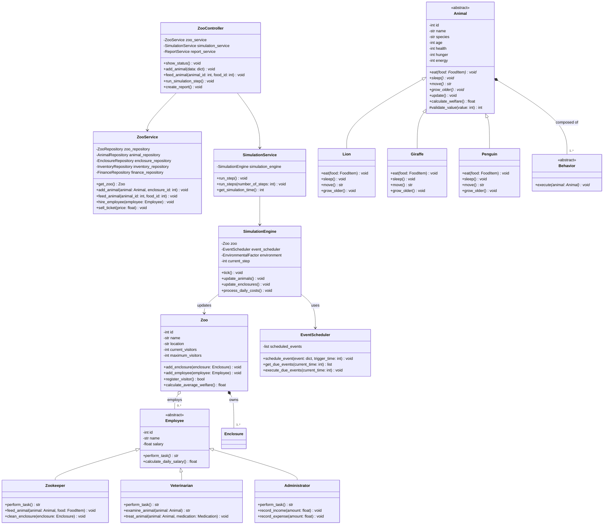

# Individual Planning — Backend (Darnell Beganovic)

This document contains the individual, schwerpunkt-specific planning for the
Backend focus area, as required by the module assignment. Shared decisions
(overall scope, architecture, team structure) are documented in
[`planning.md`](planning.md); this document goes into the detail owned by the
Backend role: the domain model, the service/controller layer and the
simulation core.

## 1. Scope of the Backend Focus

The Backend focus area covers:

- The domain layer: `Zoo`, `Employee` hierarchy, `Animal` hierarchy,
  `Enclosure`, `Inventory`, `FinanceManager`, `Transaction`.
- The service layer: `ZooService`, `SimulationService`. `ReportService`
  is owned by the Database focus (Kaiss), since it builds directly on the
  repositories' `get_as_dataframe()` methods and CSV/Excel export.
- The controller layer: `ZooController`, which mediates between the Flask
  frontend (Alessio) and the service layer.
- The simulation core: `SimulationEngine`, `EventScheduler`,
  `EnvironmentalFactor`.

The Backend layer depends on the Repository interfaces (owned by the
Database focus, Kaiss) but never on a concrete SQLite implementation
directly (Dependency Inversion Principle).

## 2. Class Diagram (Backend Focus)

The diagram below is the Backend-relevant subset of the full class diagram in
[`../../Projektplanung/Klassendiagramm_Code.md`](../../Projektplanung/Klassendiagramm_Code.md).

## 3. OOP Principles Applied in the Backend

- **Abstraction**: `Employee` and `Animal` are abstract base classes; concrete
  subclasses implement `perform_task()` / `eat()`, `sleep()`, `move()`.
- **Inheritance & Polymorphism**: `Zookeeper`, `Veterinarian`, `Administrator`
  all implement `perform_task()` differently; `Lion`, `Giraffe`, `Penguin`
  implement `eat()`/`move()` differently while being usable through the
  common `Animal` interface in `SimulationEngine.update_animals()`.
- **Encapsulation**: `Animal` attributes such as `health`, `hunger`, `energy`
  are private and only change through validated methods
  (`#validate_value`), preventing invalid states (e.g. negative hunger).
- **Composition**: `Animal` is composed of `Behavior` objects; `Zoo` is
  composed of `Enclosure` and aggregates `Employee`.
- **Single Responsibility**: `ZooService` handles business rules,
  `SimulationEngine` only advances simulation time, `ZooController` only
  coordinates requests from the frontend.
- **Dependency Inversion**: `ZooService` depends on repository *interfaces*
  (`AnimalRepository`, `FinanceRepository`, …), never on the SQLite
  implementation directly — this keeps the Database focus (Kaiss)
  swappable without touching backend code.

## 4. Test Descriptions (described, not implemented)

Per the assignment, at least two test cases are described for each function
below; they are **not** implemented as automated pytest code.

### `ZooService.feed_animal(animal_id, food_id)`

- TC-B01: Given an animal with hunger=80 and available food, when
  `feed_animal` is called, then hunger decreases and inventory quantity
  decreases by the expected amount.
- TC-B02: Given an animal id that does not exist, when `feed_animal` is
  called, then a `ValueError`/domain exception is raised and no inventory
  change occurs.

### `Animal.eat(food)` (polymorphic, e.g. `Lion`)

- TC-B03: Given a `Lion` with hunger=50 and a food item matching its
  preference, when `eat(food)` is called, then hunger decreases and health
  does not decrease.
- TC-B04: Given a `Lion` and a food item quantity of 0, when `eat(food)` is
  called, then hunger stays unchanged and a "food unavailable" result is
  returned.

### `Employee.perform_task()` (polymorphic, e.g. `Veterinarian.treat_animal`)

- TC-B05: Given a sick animal (health=30) and available medication, when
  `treat_animal` is called, then health increases and medication quantity
  decreases.
- TC-B06: Given a healthy animal (health=100), when `treat_animal` is
  called, then health is capped at the maximum value (no overflow).

### `SimulationEngine.tick()`

- TC-B07: Given a zoo with 2 enclosures and 3 animals, when `tick()` is
  called once, then every animal's `hunger`/`energy`/`age` is updated exactly
  once and `current_step` increases by 1.
- TC-B08: Given a scheduled event due at the current simulation time, when
  `tick()` is called, then `EventScheduler.execute_due_events()` is invoked
  and the event is removed from the pending queue.

### `Zoo.register_visitor()`

- TC-B09: Given `current_visitors < maximum_visitors`, when
  `register_visitor()` is called, then it returns `True` and
  `current_visitors` increases by 1.
- TC-B10: Given `current_visitors == maximum_visitors`, when
  `register_visitor()` is called, then it returns `False` and
  `current_visitors` stays unchanged.

## 5. Open Questions / Assumptions

- The exact division of validation between the Flask layer (Alessio) and the
  service layer (Darnell) is: Flask validates input *shape* (e.g. required
  fields present, correct type), the service layer validates *domain rules*
  (e.g. hunger cannot go below 0).
