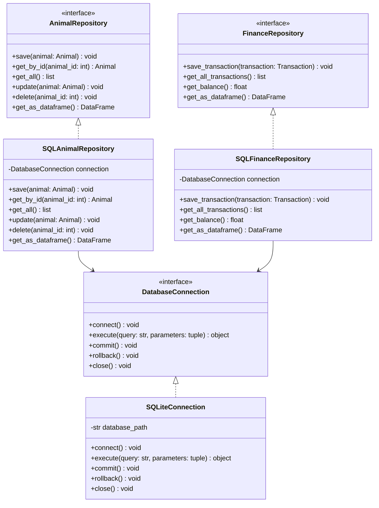

# Individual Planning — Database (Kaiss Saleh)

This document contains the individual, schwerpunkt-specific planning for the
Database focus area, as required by the module assignment. Shared decisions
(overall scope, architecture, team structure) are documented in
[`planning.md`](planning.md); this document goes into the detail owned by the
Database role: SQLite persistence and the Repository Pattern.

## 1. Scope of the Database Focus

The Database focus area covers:

- Database design and the SQLite schema (`database/schema.sql`).
- The `DatabaseConnection` abstraction and its SQLite implementation.
- All concrete `SQL*Repository` classes implementing the repository
  interfaces owned by the Backend focus (Darnell).
- CSV and Excel export of report data (`ReportService` depends on the
  repository `get_as_dataframe()` methods).

Only SQLite is planned as a persistence backend (see NFR-04/NFR-05 in
`Funktionale_und_nichtfunktionale_Anforderungen.md`); no MySQL variant is
implemented or planned.

## 2. Class Diagram (Database Focus)

Database-relevant subset of the full class diagram in
[`../../Projektplanung/Klassendiagramm_Code.md`](../../Projektplanung/Klassendiagramm_Code.md).

## 3. Database Schema

The entity-relationship model, including primary and foreign keys, is
maintained in
[`../../Projektplanung/ER_Diagram_Data_Model.md`](../../Projektplanung/ER_Diagram_Data_Model.md).
Key relationships:

- `ZOO (1) --- (N) ENCLOSURE` via `ENCLOSURE.zoo_id` (FK)
- `ENCLOSURE (1) --- (N) ANIMAL` via `ANIMAL.enclosure_id` (FK)
- `ZOO (1) --- (1) INVENTORY` via `INVENTORY.zoo_id` (FK)
- `INVENTORY (1) --- (N) FOOD_ITEM` / `MEDICATION` via `inventory_id` (FK)
- `ZOO (1) --- (N) EMPLOYEE`, `TRANSACTION`, `SCHEDULED_EVENT` via `zoo_id` (FK)

## 4. OOP Principles Applied in the Database Layer

- **Abstraction & Dependency Inversion**: repository interfaces
  (`AnimalRepository`, `FinanceRepository`, …) and `DatabaseConnection` are
  abstract; the Backend depends only on these interfaces, never on
  `SQLiteConnection` directly.
- **Encapsulation**: SQL statements and connection handling stay inside the
  `SQL*Repository` classes; callers never see raw SQL.
- **Single Responsibility**: each repository is responsible for exactly one
  entity's persistence (`SQLAnimalRepository` only persists `Animal`, etc.).
- **Open/Closed Principle**: a new persistence backend could be added by
  implementing the existing interfaces again, without modifying
  `ZooService` or any other backend class.

## 5. Test Descriptions (described, not implemented)

Per the assignment, at least two test cases are described for each function
below; they are **not** implemented as automated pytest code.

### `SQLAnimalRepository.save(animal)`

- TC-D01: Given a new, valid `Animal` object, when `save()` is called, then
  a new row is inserted and `get_by_id()` afterwards returns matching data.
- TC-D02: Given a database connection failure (e.g. locked file), when
  `save()` is called, then the transaction is rolled back and no partial row
  is written.

### `SQLAnimalRepository.get_by_id(animal_id)`

- TC-D03: Given an `animal_id` that exists, when `get_by_id()` is called,
  then the returned `Animal` object's attributes match the stored row.
- TC-D04: Given an `animal_id` that does not exist, when `get_by_id()` is
  called, then `None` (or a domain-specific "not found" result) is returned
  instead of raising an unhandled exception.

### `SQLFinanceRepository.get_balance()`

- TC-D05: Given transactions totalling +500 income and -200 expenses, when
  `get_balance()` is called, then it returns 300.
- TC-D06: Given no transactions exist yet, when `get_balance()` is called,
  then it returns 0 instead of raising an error.

### `SQLInventoryRepository.get_as_dataframe()` (used for CSV/Excel export)

- TC-D07: Given 3 food items and 2 medications in inventory, when
  `get_as_dataframe()` is called, then the resulting `DataFrame` has 5 rows
  with the correct column names.
- TC-D08: Given an empty inventory, when `get_as_dataframe()` is called,
  then an empty `DataFrame` with the correct columns (not `None`) is
  returned, so `ReportService` can still export a valid (empty) report.

## 6. Open Questions / Assumptions

- Migrations are handled by re-running `database/schema.sql` against a fresh
  SQLite file for now; a dedicated migration tool is out of scope given the
  project size.
