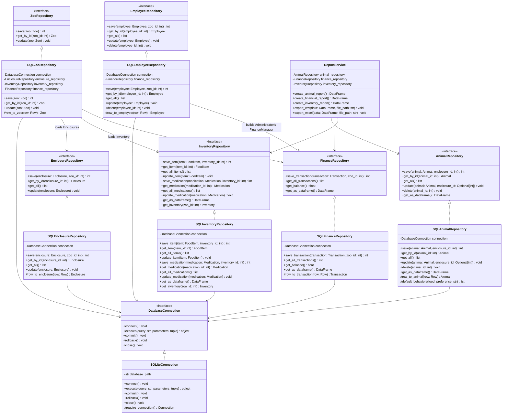

# Individual Planning — Database (Kaiss Saleh)

This document contains the individual, schwerpunkt-specific planning for the
Database focus area, as required by the module assignment. Shared decisions
(overall scope, architecture, team structure) are documented in
[`planning.md`](planning.md); this document goes into the detail owned by the
Database role: SQLite persistence and the Repository Pattern.

## 1. Scope of the Database Focus

The Database focus area covers:

- Database design and the SQLite schema (`database/schema.sql`).
- The `DatabaseConnection` abstraction and its SQLite implementation.
- All Repository interfaces (`repositories/interfaces/`): `ZooRepository`,
  `AnimalRepository`, `EnclosureRepository`, `EmployeeRepository`,
  `InventoryRepository`, `FinanceRepository`. These define the contracts the
  Backend focus (Darnell) programs against (Dependency Inversion Principle),
  but the interfaces themselves belong to the Repository Layer, which is
  owned by the Database focus (see the layer table in `planning.md` §7.1).
- All concrete `SQL*Repository` classes (`repositories/sqlite/`) implementing
  those interfaces.
- `ReportService` (in `services/report_service.py`): builds animal,
  financial and inventory reports on top of the repositories'
  `get_as_dataframe()` methods and exports them as CSV/Excel. It lives in
  the `services/` folder for architectural reasons (Service Layer), but is
  owned by the Database focus since it is purely a thin layer over the
  repository data.

Only SQLite is planned as a persistence backend (see NFR-03 in
`../../Projektplanung/Funktionale_und_nichtfunktionale_Anforderungen.md` and
NFR-05 in `planning.md`); no MySQL variant is implemented or planned.

## 2. Class Diagram (Database Focus)

Database-relevant subset of the full class diagram in
[`../../Projektplanung/Klassendiagramm_Code.md`](../../Projektplanung/Klassendiagramm_Code.md).

### 2.1 Return-Type & Aggregate-Reconstruction Fixes (fixed 2026-08-09)

Two categories of fix, both verified with an actual SQLite round trip
(create schema → `save()` → `get_by_id()`) for every repository, not just
read from the code:

**`save*()` return type was always `void` in this diagram, never matched the
code.** Every `save`/`save_item`/`save_medication`/`save_transaction`
method has returned `int` (`cursor.lastrowid`) since it was first written
(see e.g. `repositories/interfaces/animal_repository.py`'s own docstring:
*"Returns: int: the animal_id assigned by the database"*) - callers need
the generated id to keep using the object they just saved. The diagram
above now says `int` everywhere `save*()` appears, and
`save_item`/`save_medication`/`save_transaction` now show the
`inventory_id`/`zoo_id` parameter the real methods have always required
(also previously missing from this diagram).

**`get_by_id()`/`get_all()` crashed for `Zoo`, `Animal` and `Administrator`
rows - `TypeError`, not a design choice.** `_row_to_zoo()`/`_row_to_animal()`/
`_row_to_employee()` were calling the domain constructors without
arguments those constructors require (`Zoo` needs `enclosures`/
`inventory`/`finance_manager`; `Lion`/`Giraffe`/`Penguin` need
`behaviors`; `Administrator` needs `finance_manager`) - none of these are
columns on their own table. Fixed by:

- `SQLZooRepository` now takes `EnclosureRepository`/`InventoryRepository`/
  `FinanceRepository` as constructor dependencies (added to the diagram
  above) and uses them in `_row_to_zoo()` to load the real Enclosures/
  Inventory/balance - the same Dependency Inversion the rest of this layer
  already uses, one level up since `Zoo` is the aggregate root.
- `InventoryRepository` gained `get_inventory(zoo_id: int) Inventory` (new
  abstract method, added to the diagram above) - there was previously no
  way to obtain a populated `Inventory` object at all, only its individual
  FoodItem/Medication rows.
- `SQLAnimalRepository._row_to_animal()` assigns every reconstructed
  animal a fixed default `Behavior` set (`#default_behaviors()`, added to
  the diagram above) built from the stored `food_preference` - `Behavior`
  objects are not persisted anywhere (no table for them; see `database/schema.sql`'s header comment), so there
  is nothing to load back. This satisfies `Animal`'s `1..*` Behavior
  composition requirement but does not restore whatever Behaviors the
  animal had before saving.
- `SQLEmployeeRepository` now takes a `FinanceRepository` dependency
  (added to the diagram above) and builds a fresh
  `FinanceManager(balance=...)` only when reconstructing an
  `Administrator` row - see §6 for why this is a new object, not
  literally the same one another loaded `Zoo` owns.

See §6 for the underlying assumptions these fixes rely on.

## 3. Database Schema

The entity-relationship model, including primary and foreign keys, is
maintained in
[`../../Projektplanung/ER_Diagram_Data_Model.md`](../../Projektplanung/ER_Diagram_Data_Model.md).
Key relationships:

- `ZOO (1) --- (N) ENCLOSURE` via `ENCLOSURE.zoo_id` (FK)
- `ENCLOSURE (0..1) --- (N) ANIMAL` via `ANIMAL.enclosure_id` (nullable FK; an
  animal can exist without an enclosure, see Aggregation in `planning.md`
  §8.5)
- `ZOO (1) --- (1) INVENTORY` via `INVENTORY.zoo_id` (FK)
- `INVENTORY (1) --- (N) FOOD_ITEM` / `MEDICATION` via `inventory_id` (FK)
- `ZOO (1) --- (N) EMPLOYEE`, `TRANSACTION` via `zoo_id` (FK)

## 4. OOP Principles Applied in the Database Layer

- **Abstraction & Dependency Inversion**: repository interfaces
  (`AnimalRepository`, `FinanceRepository`, …) and `DatabaseConnection` are
  abstract; the Backend depends only on these interfaces, never on
  `SQLiteConnection` directly.
- **Encapsulation**: SQL statements and connection handling stay inside the
  `SQL*Repository` classes; callers never see raw SQL.
- **Single Responsibility**: each repository is responsible for exactly one
  entity's persistence (`SQLAnimalRepository` only persists `Animal`, etc.).
- **Open/Closed Principle**: a new persistence backend could be added by
  implementing the existing interfaces again, without modifying
  `ZooService` or any other backend class.

## 5. Test Descriptions (described, not implemented)

Per the assignment, at least two test cases are described for each function;
they are **not** implemented as automated pytest code. To avoid maintaining
the same test descriptions in two places, the canonical location for each
function's test cases is its own docstring (`Test:` section) in the source
file — see e.g. `database/database_connection.py`,
`repositories/sqlite/sqlite_animal_repository.py`,
`repositories/sqlite/sqlite_finance_repository.py`,
`repositories/sqlite/sqlite_inventory_repository.py`. This section only
keeps a short pointer per class so the test scope is still discoverable from
the planning document.

- `DatabaseConnection` / `SQLiteConnection` — see docstrings in
  `database/database_connection.py`.
- `SQL*Repository` classes (`ZooRepository`, `AnimalRepository`,
  `EnclosureRepository`, `EmployeeRepository`, `InventoryRepository`,
  `FinanceRepository` implementations) — see docstrings in
  `repositories/sqlite/*.py`.
- `ReportService` — see docstrings in `services/report_service.py`.

## 6. Open Questions / Assumptions

- Migrations are handled by re-running `database/schema.sql` against a fresh
  SQLite file for now; a dedicated migration tool is out of scope given the
  project size.
- `AnimalRepository.save()`/`update()` take `enclosure_id` as a separate
  parameter rather than reading it off the `Animal` object, because `Animal`
  carries no `enclosure_id` attribute in the class diagram (unidirectional
  aggregation `Enclosure o-- Animal`). This mirrors
  `ZooService.add_animal(animal, enclosure_id)`. `update()` treats
  `enclosure_id=None` as "leave the current assignment unchanged", not as
  "unassign" — explicitly clearing an animal's enclosure is not a current
  requirement.
- `EnclosureRepository.save()` takes `zoo_id` as a separate parameter for the
  same reason: `Enclosure` carries no `zoo_id` attribute in the class
  diagram. Unlike Animal's enclosure_id, an Enclosure's zoo assignment never
  changes after creation, so `update()` does not take a `zoo_id` parameter.
- `EmployeeRepository.save()` takes `zoo_id` as a separate parameter for the
  same reason: `Employee` carries no `zoo_id` attribute in the class
  diagram. As with Enclosure, an Employee's zoo assignment never changes
  after hiring, so `update()` does not take a `zoo_id` parameter either.
- **Single-zoo scoping (added 2026-08-09):** `EnclosureRepository.get_all()`
  and `FinanceRepository.get_balance()`/`get_all_transactions()` have no
  `zoo_id` filter - they return every row in the table, matching the
  single-zoo assumption already implicit everywhere else in this project
  (e.g. `MockZooController` hardcodes zoo id 1; nothing in `aufgabe.md` or
  `planning.md` asks for multi-zoo support). `SQLZooRepository._row_to_zoo()`
  relies on this when loading a Zoo's Enclosures/balance. If the project
  ever needs more than one Zoo, these two methods would need a `zoo_id`
  parameter added - `get_inventory(zoo_id)` (see §2.1) already takes one
  and shows the pattern to follow.
- **Behavior is not persisted (added 2026-08-09):** no `behavior` table
  exists (see `database/schema.sql`'s header comment) - `Behavior` objects
  have no meaningful state worth a
  table of their own for this project's scope (they are cheap to
  recreate, e.g. `RestBehavior(30)`), and nothing ever reported this as a
  gap before the §2.1 fix, since `get_by_id()`/`get_all()` on
  `AnimalRepository` had never been exercised end-to-end until then. If a
  future requirement needs an animal's exact Behavior composition to
  survive a reload, this would need its own table plus a
  `BehaviorRepository`, which is out of scope for this submission.
- **FinanceManager has no persisted identity (added 2026-08-09):** there
  is no `finance_manager` table and no FK anywhere pointing at one -
  `FinanceManager` is a pure in-memory wrapper around
  `FinanceRepository.get_balance()`'s number. This means
  `SQLZooRepository`/`SQLEmployeeRepository` each build their *own*
  `FinanceManager` instance from the same balance when reconstructing a
  Zoo/Administrator - equal in value, not the same Python object. Two
  separately-loaded `Administrator`s (or a loaded `Zoo` and a loaded
  `Administrator`) will not observe each other's `record_income()`/
  `record_expense()` calls at the object-identity level; only the next
  fresh `get_balance()` read reflects everyone's changes, since that read
  always comes straight from the `transaction` table.
- **CHECK constraints (added 2026-08-09):** `schema.sql` now enforces the
  same 0-100 ranges Python already clamps for `animal.health/hunger/energy`
  and `enclosure.cleanliness`, plus non-negative checks for `animal.age`,
  `employee.salary` and `food_item.price_per_unit`/`*.minimum_quantity` -
  closing a gap where those columns had no DB-level protection while
  `zoo.current_visitors`, `enclosure.capacity` and `*.quantity` already
  did. `enclosure.temperature` intentionally still has no CHECK - it has
  no fixed valid range in the domain model either.
- **`ZooRepository.save()` does not cascade (found while re-verifying the
  §2.1 fix, 2026-08-09):** it only writes the `zoo` table's own row -
  `zoo.enclosures`/`.inventory`/`.finance_manager` are not
  auto-persisted, the same way `EnclosureRepository.save(enclosure,
  zoo_id)` already required the caller to pass `zoo_id` in separately
  rather than being reachable from `Zoo.save()`. This was always true,
  but only became an observable *consequence* once §2.1 fixed
  `get_by_id()`: calling `get_by_id()` right after `save()` without also
  separately saving that Zoo's Enclosures now raises `ValueError` (`Zoo`
  requires `1..*` Enclosures) instead of the old, unconditional
  `TypeError` that masked this either way. The intended usage is the same
  multi-step sequence already implied by `EnclosureRepository`/
  `InventoryRepository`'s signatures: save the Zoo first, then save each
  Enclosure/Inventory item using the returned `zoo_id`/`inventory_id` -
  presumably `ZooService`'s job once the Backend focus implements it, not
  something a single repository call does on its own. Verified with an
  explicit round-trip test (save a Zoo with an unsaved Enclosure, confirm
  `get_by_id()` raises `ValueError` as expected, not a crash).
