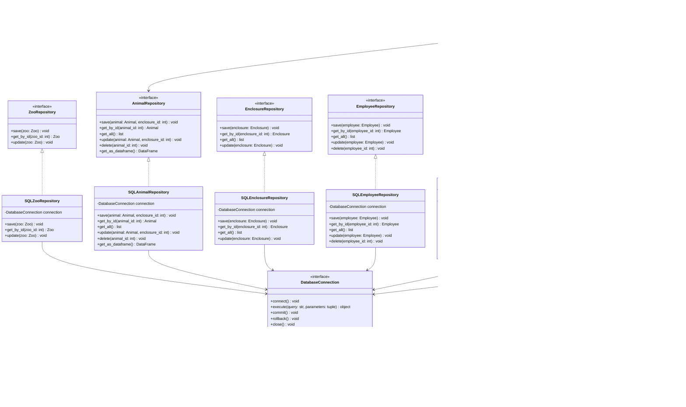

# Individual Planning — Database (Kaiss Saleh)

This document contains the individual, schwerpunkt-specific planning for the
Database focus area, as required by the module assignment. Shared decisions
(overall scope, architecture, team structure) are documented in
[`planning.md`](planning.md); this document goes into the detail owned by the
Database role: SQLite persistence and the Repository Pattern.

## 1. Scope of the Database Focus

The Database focus area covers:

- Database design and the SQLite schema (`database/schema.sql`).
- The `DatabaseConnection` abstraction and its SQLite implementation.
- All Repository interfaces (`repositories/interfaces/`): `ZooRepository`,
  `AnimalRepository`, `EnclosureRepository`, `EmployeeRepository`,
  `InventoryRepository`, `FinanceRepository`. These define the contracts the
  Backend focus (Darnell) programs against (Dependency Inversion Principle),
  but the interfaces themselves belong to the Repository Layer, which is
  owned by the Database focus (see the layer table in `planning.md` §7.1).
- All concrete `SQL*Repository` classes (`repositories/sqlite/`) implementing
  those interfaces.
- `ReportService` (in `services/report_service.py`): builds animal,
  financial and inventory reports on top of the repositories'
  `get_as_dataframe()` methods and exports them as CSV/Excel. It lives in
  the `services/` folder for architectural reasons (Service Layer), but is
  owned by the Database focus since it is purely a thin layer over the
  repository data.

Only SQLite is planned as a persistence backend (see NFR-03 in
`../../Projektplanung/Funktionale_und_nichtfunktionale_Anforderungen.md` and
NFR-05 in `planning.md`); no MySQL variant is implemented or planned.

## 2. Class Diagram (Database Focus)

Database-relevant subset of the full class diagram in
[`../../Projektplanung/Klassendiagramm_Code.md`](../../Projektplanung/Klassendiagramm_Code.md).

## 3. Database Schema

The entity-relationship model, including primary and foreign keys, is
maintained in
[`../../Projektplanung/ER_Diagram_Data_Model.md`](../../Projektplanung/ER_Diagram_Data_Model.md).
Key relationships:

- `ZOO (1) --- (N) ENCLOSURE` via `ENCLOSURE.zoo_id` (FK)
- `ENCLOSURE (0..1) --- (N) ANIMAL` via `ANIMAL.enclosure_id` (nullable FK; an
  animal can exist without an enclosure, see Aggregation in `planning.md`
  §8.5)
- `ZOO (1) --- (1) INVENTORY` via `INVENTORY.zoo_id` (FK)
- `INVENTORY (1) --- (N) FOOD_ITEM` / `MEDICATION` via `inventory_id` (FK)
- `ZOO (1) --- (N) EMPLOYEE`, `TRANSACTION` via `zoo_id` (FK)

## 4. OOP Principles Applied in the Database Layer

- **Abstraction & Dependency Inversion**: repository interfaces
  (`AnimalRepository`, `FinanceRepository`, …) and `DatabaseConnection` are
  abstract; the Backend depends only on these interfaces, never on
  `SQLiteConnection` directly.
- **Encapsulation**: SQL statements and connection handling stay inside the
  `SQL*Repository` classes; callers never see raw SQL.
- **Single Responsibility**: each repository is responsible for exactly one
  entity's persistence (`SQLAnimalRepository` only persists `Animal`, etc.).
- **Open/Closed Principle**: a new persistence backend could be added by
  implementing the existing interfaces again, without modifying
  `ZooService` or any other backend class.

## 5. Test Descriptions (described, not implemented)

Per the assignment, at least two test cases are described for each function;
they are **not** implemented as automated pytest code. To avoid maintaining
the same test descriptions in two places, the canonical location for each
function's test cases is its own docstring (`Test:` section) in the source
file — see e.g. `database/database_connection.py`,
`repositories/sqlite/sqlite_animal_repository.py`,
`repositories/sqlite/sqlite_finance_repository.py`,
`repositories/sqlite/sqlite_inventory_repository.py`. This section only
keeps a short pointer per class so the test scope is still discoverable from
the planning document.

- `DatabaseConnection` / `SQLiteConnection` — see docstrings in
  `database/database_connection.py`.
- `SQL*Repository` classes (`ZooRepository`, `AnimalRepository`,
  `EnclosureRepository`, `EmployeeRepository`, `InventoryRepository`,
  `FinanceRepository` implementations) — see docstrings in
  `repositories/sqlite/*.py`.
- `ReportService` — see docstrings in `services/report_service.py`.

## 6. Open Questions / Assumptions

- Migrations are handled by re-running `database/schema.sql` against a fresh
  SQLite file for now; a dedicated migration tool is out of scope given the
  project size.
- `AnimalRepository.save()`/`update()` take `enclosure_id` as a separate
  parameter rather than reading it off the `Animal` object, because `Animal`
  carries no `enclosure_id` attribute in the class diagram (unidirectional
  aggregation `Enclosure o-- Animal`). This mirrors
  `ZooService.add_animal(animal, enclosure_id)`. `update()` treats
  `enclosure_id=None` as "leave the current assignment unchanged", not as
  "unassign" — explicitly clearing an animal's enclosure is not a current
  requirement.
