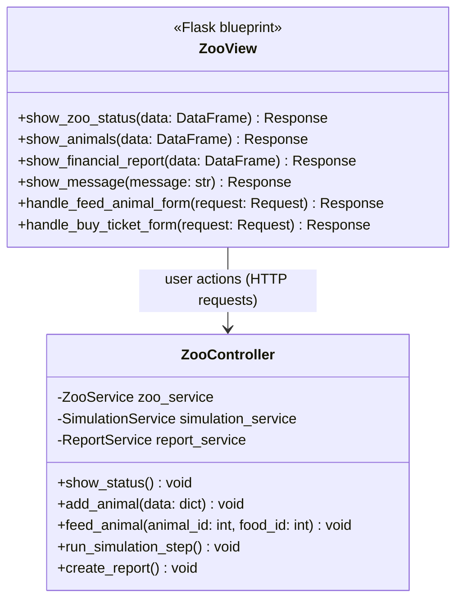

# Individual Planning — Frontend (Alessio Bellamacina)

This document contains the individual, schwerpunkt-specific planning for the
Frontend focus area, as required by the module assignment. Shared decisions
(overall scope, architecture, team structure) are documented in
[`planning.md`](planning.md); this document goes into the detail owned by the
Frontend role: the Flask-based web user interface.

## 1. Scope of the Frontend Focus

The Frontend focus area covers the Presentation Layer of the layered
architecture (see `planning.md` section 7.1):

- Flask routes/blueprints that expose the application's use cases
  (zoo status, feeding, treatment, finances, reports) to the browser.
- Jinja2 templates that render the data provided by the Controller layer.
- Client-facing input forms (e.g. "feed animal" form, "buy ticket" form)
  and their surface-level validation (required fields, correct types).
- Display of success/error messages returned by `ZooController`.

The Frontend never talks to the domain model, services or repositories
directly — it only calls `ZooController`, which keeps the presentation layer
replaceable (e.g. swapping Flask for another web framework later) without
touching backend logic.

## 2. Class Diagram (Frontend Focus)

Frontend-relevant subset of the full class diagram in
[`../../Projektplanung/Klassendiagramm_Code.md`](../../Projektplanung/Klassendiagramm_Code.md).
`ZooView` is realised as a set of Flask routes/templates rather than a single
console class.

## 3. Page / Route Overview

| Route | Method | Purpose | Controller call |
|-------|--------|---------|------------------|
| `/` | GET | Show zoo dashboard (visitors, enclosures) | `ZooController.show_status()` |
| `/animals` | GET | List all animals with state (hunger, health, energy) | `ZooController.show_status()` |
| `/animals/<id>/feed` | POST | Submit feeding form | `ZooController.feed_animal()` |
| `/tickets/buy` | POST | Submit ticket purchase form | `ZooController` (sells ticket via `ZooService`) |
| `/simulation/step` | POST | Trigger one simulation tick | `ZooController.run_simulation_step()` |
| `/reports/financial` | GET | Display / download financial report (CSV/Excel) | `ZooController.create_report()` |

## 4. OOP Principles Applied in the Frontend

- **Abstraction**: The Frontend only knows the `ZooController` interface, not
  the concrete domain classes behind it — the controller abstracts away
  service and repository details.
- **Single Responsibility**: Each Flask route has exactly one job (render a
  page or handle one form submission); no business logic lives in the
  view functions.
- **Separation of Concerns / MVC-inspired structure**: Presentation
  (Flask templates), application flow (`ZooController`) and business logic
  (`ZooService`) remain in distinct modules/files, matching the assignment's
  requirement for a visibly separated architecture.

## 5. Test Descriptions (described, not implemented)

Per the assignment, at least two test cases are described for each function
below; they are **not** implemented as automated pytest code.

### `handle_feed_animal_form(request)`

- TC-F01: Given a POST request with a valid `animal_id` and `food_id`, when
  the form is submitted, then `ZooController.feed_animal()` is called with
  the parsed values and a success message is rendered.
- TC-F02: Given a POST request missing the `food_id` field, when the form is
  submitted, then the request is rejected with a 400 response and an error
  message is shown, without calling the controller.

### `show_zoo_status(data)`

- TC-F03: Given a non-empty `DataFrame` of enclosures/animals, when
  `show_zoo_status` is called, then the dashboard template renders one row
  per enclosure.
- TC-F04: Given an empty `DataFrame` (no enclosures yet), when
  `show_zoo_status` is called, then a friendly "no enclosures yet" message is
  rendered instead of an empty table.

### `handle_buy_ticket_form(request)`

- TC-F05: Given a POST request with a valid ticket price, when the form is
  submitted, then `ZooController` records the sale and a confirmation page is
  rendered.
- TC-F06: Given the zoo is at `maximum_visitors` capacity, when the form is
  submitted, then an error message "zoo is full" is rendered and no
  transaction is recorded.

### `show_financial_report(data)`

- TC-F07: Given financial data exists, when the report route is requested
  with `format=csv`, then a downloadable CSV file is returned.
- TC-F08: Given financial data exists, when the report route is requested
  with `format=xlsx`, then a downloadable Excel file is returned.

## 6. Open Questions / Assumptions

- Session/authentication is out of scope (see `planning.md` section 4.2), so
  all routes are currently unauthenticated; role-based access (NFR-02 in
  `Funktionale_und_nichtfunktionale_Anforderungen.md`) is a stretch goal if
  time permits.
