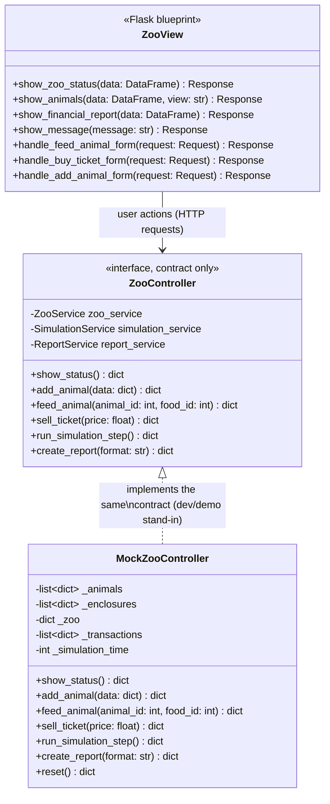

# Individual Planning — Frontend (Alessio Bellamacina)

This document contains the individual, schwerpunkt-specific planning for the
Frontend focus area, as required by the module assignment. Shared decisions
(overall scope, architecture, team structure) are documented in
[`planning.md`](planning.md); this document goes into the detail owned by the
Frontend role: the Flask-based web user interface.

Sections 3.2 and the corresponding entries in sections 3 and 5 were added
2026-08-09 with support from Kaiss Saleh (Datenbank-Schwerpunkt), documenting
the Tycoon/game feature expansion he helped build on top of Alessio's
original Frontend work — see section 3.2 for details and attribution notes
in the affected source files themselves.

## 1. Scope of the Frontend Focus

The Frontend focus area covers the Presentation Layer of the layered
architecture (see `planning.md` section 7.1):

- Flask routes/blueprints that expose the application's use cases
  (zoo status, feeding, treatment, finances, reports) to the browser.
- Jinja2 templates that render the data provided by the Controller layer.
- Client-facing input forms (e.g. "feed animal" form, "buy ticket" form)
  and their surface-level validation (required fields, correct types).
- Display of success/error messages returned by `ZooController`.

The Frontend never talks to the domain model, services or repositories
directly — it only calls `ZooController`, which keeps the presentation layer
replaceable (e.g. swapping Flask for another web framework later) without
touching backend logic.

## 2. Class Diagram (Frontend Focus)

Frontend-relevant subset of the full class diagram in
[`../../Projektplanung/Klassendiagramm_Code.md`](../../Projektplanung/Klassendiagramm_Code.md).
`ZooView` is realised as a set of Flask routes/templates rather than a single
console class.



### 2.1 ZooController Result Contract (agreed 2026-08-06)

The class diagram in `planning.md`/`Klassendiagramm_Code.md` originally showed
every `ZooController` method returning `void`. In practice the Frontend needs
both the requested data and a success/error signal, so all `ZooController`
methods return a uniform result dict instead:

```python
{"success": bool, "message": str, "data": Any}
```

- `success` drives whether the view renders a success or error flash message.
- `message` is a human-readable string shown to the user as-is.
- `data` carries the payload the route needs to render (e.g. a DataFrame /
  dict for `show_status()`, or file info for `create_report()`).

`ZooController.sell_ticket(price: float)` was added to close a gap between
this route table and the class diagram, which had no ticket-related method
(only `ZooService.sell_ticket()` existed). `create_report()` now takes a
`format: str` argument (`"csv"`, `"xlsx"`, or `None`/`"html"` for the plain
report view) and its `data` field carries `{"file_path": str, "mimetype":
str}` so the Flask route can stream the file back with `send_file()` without
building CSV/Excel content itself.

### 2.2 Implementation Note: `Response` Return Type (agreed 2026-08-06)

The class diagram types every `ZooView` rendering/handling method (
`show_zoo_status`, `show_animals`, `show_financial_report`, `show_message`,
`handle_feed_animal_form`, `handle_buy_ticket_form`) as returning `Response`.
In the actual Flask code these functions are implemented with a Python
return type of `str` (the string produced by `render_template()`), not an
explicit `flask.Response` object. This is intentional and does not
contradict the diagram: Flask automatically wraps a `str` returned from a
view function into a full `Response` object (status 200, headers, etc.)
before it reaches the client, which is idiomatic Flask and avoids
unnecessary boilerplate (`make_response(render_template(...))`) on every
route. The diagram's `Response` return type describes the HTTP-level
outcome the client receives, not the literal Python return type of the
implementing function.

Flask route functions that only dispatch to a `ZooController` call and then
delegate rendering (e.g. the `/`-route function that calls
`ZooController.show_status()` and hands the result to `show_zoo_status()`)
are pure routing/error-handling glue and are intentionally not listed as
separate `ZooView` methods in the class diagram — only the methods that do
meaningful rendering/handling work are modelled there, per the Single
Responsibility principle already stated in section 4.

## 3. Page / Route Overview

| Route | Method | Purpose | Controller call |
|-------|--------|---------|------------------|
| `/` | GET | Show zoo dashboard (visitors, enclosures, employees) | `ZooController.show_status()` |
| `/animals` | GET | List all animals with state (hunger, health, energy) | `ZooController.show_status()` |
| `/animals/<id>/feed` | POST | Submit feeding form (picks a Zookeeper, see section 3.3) | `ZooController.feed_animal(animal_id, food_id, zookeeper_id)` |
| `/animals/<id>/treat` | POST | Submit treatment form (picks a Veterinarian, see section 3.3) | `ZooController.treat_animal(animal_id, medication_id, veterinarian_id)` |
| `/animals/<id>/remove` | POST | Remove an animal permanently (see section 3.3) | `ZooController.remove_animal(animal_id)` |
| `/animals/add` | POST | Submit "adopt animal" form (see section 3.2) | `ZooController.add_animal(data)` |
| `/employees/hire` | POST | Submit "hire employee" form (see section 3.2) | `ZooController.hire_employee(data)` |
| `/employees/<id>/remove` | POST | Remove (fire) an employee permanently (see section 3.3) | `ZooController.remove_employee(employee_id)` |
| `/enclosures/<id>/clean` | POST | Clean an enclosure (picks a Zookeeper, see section 3.3) | `ZooController.clean_enclosure(enclosure_id, zookeeper_id)` |
| `/inventory` | GET | Show the Inventory tab (stock, low-stock highlight, see section 3.3) | `ZooController.show_status()` |
| `/inventory/food/add` | POST | Submit "add food type" form | `ZooController.add_food_item(data)` |
| `/inventory/medication/add` | POST | Submit "add medication type" form | `ZooController.add_medication(data)` |
| `/inventory/<id>/restock` | POST | Restock a food/medication item | `ZooController.restock_inventory_item(item_id, is_food, amount)` |
| `/inventory/<id>/consume` | POST | Manually consume some stock | `ZooController.consume_inventory_item(item_id, is_food, amount)` |
| `/inventory/<id>/remove` | POST | Remove a food/medication item permanently | `ZooController.remove_inventory_item(item_id, is_food)` |
| `/tickets/buy` | POST | Submit ticket purchase form | `ZooController.sell_ticket(price)` |
| `/simulation/step` | POST | Trigger one simulation tick | `ZooController.run_simulation_step()` |
| `/reports/financial` | GET | Display / download financial report (CSV/Excel) | `ZooController.create_report(format)` |
| `/dev/reset`* | POST | **Not part of the contract** — resets the dev-only stub to its seed data (see section 3.2) | *none — calls `MockZooController.reset()` directly, a stub-only method* |

\* `/dev/reset` is intentionally listed with an asterisk: it is a development/demo
convenience, not a use case the module assignment asks for, and will not exist
once the real `ZooController` (which persists via SQLite, not an in-memory
reset) is swapped in. It is kept in this table only so the route inventory
stays complete and honest about what exists in the code.

### 3.1 Animal Game View on `/animals` (agreed 2026-08-06)

`/animals` gained a small, presentation-only `?view=` query parameter,
following the exact same pattern already used by `format` on
`/reports/financial` — it does not add a new route, does not change the
`ZooController` call (still `show_status()`), and therefore does not touch
the route table above:

- `?view=` absent or `?view=game` (default): renders a 2D, game-style board
  — enclosures drawn as distinct boxed "pens", each containing its animals
  as emoji sprites (🦁🦒🐧) that wander within their pen's bounds via a
  client-side JS animation loop. Clicking an animal opens a popup with its
  stats (name/species/age/health/hunger/energy), a feed form (posts to the
  existing `/animals/<id>/feed` route, normal page reload — no AJAX, no
  response-format change), and greyed-out placeholder buttons for
  animal-specific actions `ZooController` does not expose yet (e.g.
  "Behandeln"/treat), clearly marked unavailable.
- `?view=list`: renders the original plain HTML table (kept for
  accessibility/testability, reachable via a small toggle link on the game
  view).

All rendering/animation logic is pure presentation, driven entirely by data
already returned from `ZooController.show_status()` — no new backend calls.
CSS/JS live in `zoo_simulation/frontend/static/{css,js}/`, served by
Flask's default `/static` route (auto-registered by `Flask(__name__)`, no
additional Python route needed).

**Explicitly deferred:** purchasing enclosures ("Gehege kaufen") as a game
mechanic. `Enclosure` has no `price` attribute in the domain model and
`ZooController`/`ZooService` have no purchase method for enclosures (only
`Zoo.add_enclosure()`, with no cost concept) — implementing this for real
would require a Backend/Domain change (Darnell's focus), which is out of
scope for the Frontend individual submission. Revisit once/if the domain
model gains an `Enclosure.price` attribute.

### 3.2 Tycoon/Game Feature Expansion (agreed 2026-08-09, with Kaiss Saleh)

Building on the game view from section 3.1, the following was added without
changing the `ZooController` contract from section 2.1 — every point below
either (a) wires up a method the contract already promised but no route used
yet, (b) enriches the `Any`-typed `data` field of an existing method with
additional keys, or (c) is pure client-side presentation with no new
`ZooController` call at all. None of it required a change to
`Klassendiagramm_Code.md`.

- **"Tier adoptieren" (`/animals/add`, see route table above):** the first
  real usage of `ZooController.add_animal(data)` — present in the class
  diagram/contract since 2026-08-06 but never wired to a route until now. A
  modal on the game view lets a visitor pick a name (with a "🎲" random-name
  helper), species and enclosure; disabled/greyed-out `<option>`s mark
  enclosures that are full or (client-side only, see below) the wrong
  habitat for the chosen species. On success, the redirect carries a
  presentation-only `?highlight=<animal_id>` query parameter (same pattern
  as `?view=`/`?format=`) so the new animal's sprite is briefly highlighted.
- **HUD leaderboard (`templates/_hud.html`, shared by `/` and `/animals`):**
  visitor/capacity bar, simulation day, account balance, a "Zoo-Level" and
  species-collection readout, and a "Wohlfühl-/Attraktivitäts-Score" —
  all computed from data `show_status()` already returns to the Frontend
  (animal/enclosure/visitor data), just not previously displayed together.
  `show_status()`'s `data` dict gained additive keys (`simulation_time`,
  `balance`, `food_catalog`) on the stub side to support this — same dict,
  same method signature, more keys in the already-`Any`-typed payload.
- **Feeding economy:** `MockZooController.feed_animal()` now books an
  expense `Transaction` per feeding (sign convention matching
  `Transaction.is_valid()` in the domain model), priced from a small
  `_FOOD_CATALOG` stand-in for `FoodItem.price_per_unit` (the stub keeps no
  real `Inventory`). The feeding forms show a food dropdown with prices
  instead of a bare "Futter-ID" number field.
- **Explicitly presentation-only, not enforced by `ZooController`/the stub's
  domain rules:** which species fit which `enclosure_type` (a
  `SPECIES_HABITATS` map in `game.js`) and a visitor-count gate on which
  species can be adopted at all (`SPECIES_UNLOCK_VISITORS`). Both only
  disable `<option>`s in the adopt form; neither is a server-side rule,
  since the domain model has no "habitat compatibility" concept to mirror
  (unlike the enclosure-capacity check, which does mirror
  `Enclosure.has_capacity()` and is enforced in `MockZooController.add_animal()`
  regardless of what the client sends).
- **Achievements, sound, day/night skin, per-species biome theming, mood
  icons on sprites:** entirely client-side (`localStorage`, CSS
  `prefers-color-scheme`/keyframe animations, Web Audio API tones) —
  decorative feedback layered on top of data the Frontend already had, no
  new `ZooController` interaction of any kind. The day/night skin in
  particular is explicitly *not* a real `EnvironmentalFactor` simulation
  (that class exists in the Backend domain but nothing constructs/uses it
  yet) — it is a cosmetic toggle keyed off `simulation_time`'s parity.
- **`POST /dev/reset`:** see the route table note above — a stub-only
  development convenience, not part of this section's contract discussion.

### 3.3 Inventory Tab, Removal, Explicit Staff Selection (agreed 2026-08-09, with Darnell Beganovic)

Implemented together with the Backend focus - see `planning_backend_darnell.md`
section 2.11 for the full rationale of each `ZooController`/`ZooService`
change this wires up.

- **`/inventory` (new page, `templates/inventory.html`):** lists every
  stocked `FoodItem`/`Medication` with quantity/minimum quantity/price,
  highlighting rows where `is_low_stock` is true; forms to add a new
  food/medication type, restock, manually consume, and permanently
  remove a posten. Linked from the header nav (`templates/base.html`).
- **Feed/treat/clean forms now require picking a staff member:** the
  feeding and treatment forms in the animal popup
  (`templates/animals_game.html`) and the "Reinigen" form on the
  dashboard (`templates/index.html`) each gained a `<select>` populated
  from `show_status()`'s existing `employees` list, filtered by role in
  Jinja (`employees | selectattr("role", "equalto", "Zookeeper")`) —
  no new controller data was needed for this. If no employee of the
  required role is currently hired, the form is replaced by a disabled
  button with an explanatory `title`, mirroring the pattern the earlier
  "Behandeln" placeholder used, instead of letting the form 400.
- **"Alle hungrigen füttern" quick actions do not prompt per animal:**
  `game.js`'s `lastZookeeperId` remembers the last Zookeeper chosen in
  the popup (defaulting to the first employed one) and reuses it for
  both the global and per-enclosure bulk-feed buttons.
- **Remove animal/employee:** a "Entfernen" button in the animal popup
  and a matching one per row in the employee table
  (`templates/index.html`), both plain POST-and-redirect forms with no
  fields.
- **Sleeping animation guarantee (with Animal.move()/sleep() now wired
  in on the Backend side):** since simulation ticks only advance on a
  manual button click, `animation.js` gained a purely cosmetic,
  client-only `triggerRandomNap()` timer that periodically shows a
  random sprite as "sleeping" for a few seconds - independent of the
  real `energy` stat - so the 💤 animation is reliably visible within a
  short real-time window regardless of how many simulation steps have
  actually run.

## 4. OOP Principles Applied in the Frontend

- **Abstraction**: The Frontend only knows the `ZooController` interface, not
  the concrete domain classes behind it — the controller abstracts away
  service and repository details.
- **Single Responsibility**: Each Flask route has exactly one job (render a
  page or handle one form submission); no business logic lives in the
  view functions.
- **Separation of Concerns / MVC-inspired structure**: Presentation
  (Flask templates), application flow (`ZooController`) and business logic
  (`ZooService`) remain in distinct modules/files, matching the assignment's
  requirement for a visibly separated architecture.

## 5. Test Descriptions (described, not implemented)

Per the assignment, at least two test cases are described for each function
below; they are **not** implemented as automated pytest code.

### `handle_feed_animal_form(request)`

- TC-F01: Given a POST request with a valid `animal_id` and `food_id`, when
  the form is submitted, then `ZooController.feed_animal()` is called with
  the parsed values and a success message is rendered.
- TC-F02: Given a POST request missing the `food_id` field, when the form is
  submitted, then the request is rejected with a 400 response and an error
  message is shown, without calling the controller.

### `show_zoo_status(data)`

- TC-F03: Given a non-empty `DataFrame` of enclosures/animals, when
  `show_zoo_status` is called, then the dashboard template renders one row
  per enclosure.
- TC-F04: Given an empty `DataFrame` (no enclosures yet), when
  `show_zoo_status` is called, then a friendly "no enclosures yet" message is
  rendered instead of an empty table.

### `handle_buy_ticket_form(request)`

- TC-F05: Given a POST request with a valid ticket price, when the form is
  submitted, then `ZooController` records the sale and a confirmation page is
  rendered.
- TC-F06: Given the zoo is at `maximum_visitors` capacity, when the form is
  submitted, then an error message "zoo is full" is rendered and no
  transaction is recorded.

### `show_financial_report(data)`

- TC-F07: Given financial data exists, when the report route is requested
  with `format=csv`, then a downloadable CSV file is returned.
- TC-F08: Given financial data exists, when the report route is requested
  with `format=xlsx`, then a downloadable Excel file is returned.

### `show_animals(data, view)`

- TC-F09: Given animals assigned to several enclosures, when the route is
  requested without a `view` parameter (or `view=game`), then the 2D game
  board is rendered with one boxed pen per enclosure and every animal
  placed in its correct pen.
- TC-F10: Given the same data, when the route is requested with
  `view=list`, then the original plain HTML table is rendered instead,
  with one row per animal — no game-board markup.

### `handle_add_animal_form(request)` (added 2026-08-09, section 3.2)

- TC-F11: Given a POST request with a valid `name`, a known `species` and
  the `enclosure_id` of an enclosure with free capacity, when the form is
  submitted, then `ZooController.add_animal()` is called with the parsed
  values, the new animal appears on the game board after the redirect, and
  its sprite is briefly highlighted (`?highlight=<id>`).
- TC-F12: Given a POST request whose `enclosure_id` refers to an enclosure
  already at full capacity, when the form is submitted, then
  `ZooController.add_animal()` reports failure ("full capacity"), no
  animal is created, and the error message is shown after the redirect —
  the same "Flask validates shape, the controller validates domain rules"
  split used by `handle_feed_animal_form()`/`handle_buy_ticket_form()`.

## 6. Open Questions / Assumptions

- User authentication and role-based access are explicitly out of scope for
  this project (see `planning.md` section 4.2); all routes are
  unauthenticated by design, not as a temporary simplification.
- As of 2026-08-06, `ZooController` (Backend focus, Darnell) is not yet
  implemented (`controller/zoo_controller.py` is an empty file). The Frontend
  is built against `zoo_simulation/frontend/controller_stub.py`, a
  `MockZooController` that implements the exact result-dict contract from
  section 2.1 with in-memory fake data. `zoo_view.py` imports it from a
  single place so it can be swapped for the real `ZooController` import once
  it lands, without changing any route logic.
- The result-dict contract in section 2.1 (`{"success", "message", "data"}`)
  and the added `sell_ticket(price)` / `create_report(format)` signatures
  were agreed between Frontend and Backend on 2026-08-06 and should be
  reflected in `planning_backend_darnell.md`'s `ZooController` diagram once
  Darnell implements the real controller.
- As of 2026-08-09, the situation in the point above is unchanged:
  `controller/zoo_controller.py`, `services/zoo_service.py`,
  `services/simulation_service.py` and `simulation/simulation_engine.py` are
  still empty, and `zoo_simulation/main.py` (the project's actual entry
  point per the root `README.md`) is still empty too. Section 3.2's Tycoon
  expansion was therefore built the same way as the original game view:
  entirely against `controller_stub.py`. This is a known, accepted
  limitation of the Frontend submission, not something the Frontend focus
  can close on its own — wiring `main.py` to actually start the
  application (Flask app, or otherwise) is shared integration work per
  `planning.md`, and swapping in the real `ZooController` is Darnell's.
